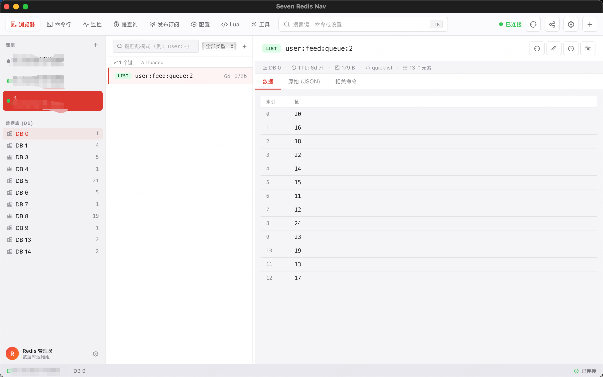

# Seven Redis Nav

[](LICENSE)
[](rust-toolchain.toml)
[](https://vuejs.org/)
[](https://tauri.app/)

> 一款基于 Tauri 2 + Vue 3 构建的 macOS 原生 Redis 可视化管理工具。

---

## 📸 界面预览

<p align="center">
  
</p>

<p align="center">
  
</p>

---

## ✨ 功能特性

- 🔌 **多连接管理** — 支持保存、切换多个 Redis 连接，密码通过系统 Keychain 安全存储
- 🔐 **SSH 隧道** — 通过跳板机 SSH 隧道安全连接内网 Redis，支持密码和私钥认证
- 🔒 **TLS 加密** — 支持 TLS/SSL 加密连接，可配置 CA 证书、客户端证书和最低 TLS 版本
- 🗂️ **Key 浏览器** — 支持 String / Hash / List / Set / ZSet 类型的查看与编辑
- 💻 **CLI 终端** — 内置 Redis 命令行终端，支持历史记录与自动补全
- 📊 **实时监控** — MONITOR 命令实时流式展示服务器命令流
- 📡 **Pub/Sub** — 可视化订阅频道，实时接收消息
- 🐢 **慢日志** — 查看 SLOWLOG，快速定位慢查询
- ⚙️ **服务器配置** — 在线查看与修改 Redis CONFIG
- 📤 **配置导入导出** — 支持连接配置的 JSON 导入导出，方便团队共享

---

## 🛠️ 技术栈

| 层级 | 技术 |
|------|------|
| 桌面框架 | [Tauri 2](https://tauri.app/) |
| 前端框架 | [Vue 3](https://vuejs.org/) + TypeScript |
| UI 组件库 | [TDesign Vue Next](https://tdesign.tencent.com/vue-next/) |
| 状态管理 | [Pinia](https://pinia.vuejs.org/) |
| 虚拟列表 | [@tanstack/vue-virtual](https://tanstack.com/virtual) |
| 后端语言 | Rust (Stable) |
| Redis 客户端 | [redis-rs](https://github.com/redis-rs/redis-rs) (tokio 异步, TLS 支持) |
| SSH 隧道 | [ssh2](https://github.com/alexcrichton/ssh2-rs) |
| TLS 加密 | [native-tls](https://github.com/sfackler/rust-native-tls) |
| 本地存储 | SQLite (via sqlx) |
| 密码存储 | macOS Keychain (security-framework) |
| 构建工具 | Vite 6 |
| 单元测试 | Vitest 3 + @vue/test-utils |
| E2E 测试 | Playwright |

---

## 📋 环境要求

在开始之前，请确保本地已安装以下工具：

### Node.js

- **版本要求**：`>= 20`（推荐使用 `.nvmrc` 中指定的 `v20`）
- 推荐使用 [nvm](https://github.com/nvm-sh/nvm) 管理 Node 版本：

```bash
nvm install
nvm use
```

### pnpm

- **版本要求**：`9.15.9`（项目通过 `packageManager` 字段锁定）
- 安装方式：

```bash
npm install -g pnpm@9.15.9
# 或
corepack enable && corepack prepare pnpm@9.15.9 --activate
```

### Rust

- **版本要求**：Stable（项目通过 `rust-toolchain.toml` 自动锁定）
- 安装方式（推荐 [rustup](https://rustup.rs/)）：

```bash
curl --proto '=https' --tlsv1.2 -sSf https://sh.rustup.rs | sh
```

安装完成后，`rust-toolchain.toml` 会自动拉取所需工具链（含 `rustfmt` 和 `clippy`）。

### Tauri 系统依赖（macOS）

Tauri 在 macOS 上依赖 Xcode Command Line Tools：

```bash
xcode-select --install
```

---

## 🔐 高级连接功能（Phase 2）

### SSH 隧道连接

适用于 Redis 部署在内网，需要通过跳板机访问的场景。

**配置步骤：**
1. 新建连接时，在「连接类型」中选择 **SSH**
2. 填写 Redis 主机（内网地址）和端口
3. 在「SSH 隧道配置」中填写跳板机信息：
   - SSH 主机：跳板机地址
   - SSH 端口：默认 22
   - SSH 用户名
   - 认证方式：密码 或 私钥文件
4. 点击「测试连接」验证 SSH 隧道 + Redis 连通性

**支持的认证方式：**
- 密码认证
- 私钥认证（支持加密私钥，需填写私钥密码）

### TLS 加密连接

适用于 Redis 开启了 TLS/SSL 加密的场景（如 Redis 6.0+ 的 TLS 模式）。

**配置步骤：**
1. 新建连接时，在「连接类型」中选择 **TLS**
2. 填写 Redis 主机和端口（通常为 6380）
3. 在「TLS 加密配置」中按需填写：
   - 是否验证服务器证书（生产环境建议开启）
   - CA 证书路径（自签名证书场景）
   - 客户端证书 + 私钥（双向 TLS 场景）
   - 最低 TLS 版本（TLS 1.2 / TLS 1.3）
   - SNI 服务器名称（可选）
4. 点击「测试连接」验证 TLS 连通性

### 配置导入导出

```bash
# 导出所有连接配置（密码不会导出）
# 在应用内：设置 → 导出配置 → 保存为 JSON 文件

# 导入配置
# 在应用内：设置 → 导入配置 → 选择 JSON 文件
```

> **安全说明**：导出的配置文件不包含密码，密码始终存储在 macOS Keychain 中。

---

### 1. 克隆仓库

```bash
git clone https://github.com/qwzhang01/seven-redis-nav.git
cd seven-redis-nav
```

### 2. 安装前端依赖

```bash
pnpm install
```

### 3. 启动开发模式

```bash
pnpm tauri dev
```

此命令会：
1. 自动启动 Vite 开发服务器（监听 `http://localhost:1420`，支持 HMR）
2. 编译 Rust 后端（首次编译较慢，约 1~3 分钟）
3. 打开原生桌面窗口（1280×800，最小 960×600）

> **提示**：Rust 代码修改后会自动重新编译并热重载；前端代码修改通过 Vite HMR 即时生效。

---

## 📦 构建打包

### 构建生产版本（桌面应用安装包）

```bash
pnpm tauri build
```

此命令会：
1. 执行 `vue-tsc --noEmit` 进行 TypeScript 类型检查
2. 执行 `vite build` 构建前端静态资源到 `dist/`
3. 使用 Rust 编译后端并将前端资源打包进原生应用
4. 输出安装包到 `src-tauri/target/release/bundle/`

macOS 下会生成：
- `.dmg` — 磁盘镜像安装包
- `.app` — 应用程序包

### 仅构建前端（不含 Tauri）

```bash
pnpm build
```

输出目录：`dist/`

---

## 🧪 测试

### 运行单元测试（watch 模式）

```bash
pnpm test
```

### 单次运行所有单元测试

```bash
pnpm test:run
```

### 带可视化 UI 的测试面板

```bash
pnpm test:ui
```

浏览器会自动打开 Vitest UI，可交互式查看测试结果。

### 生成测试覆盖率报告

```bash
pnpm test:coverage
```

覆盖率报告输出到 `coverage/` 目录，HTML 报告可用浏览器直接打开：

```bash
open coverage/index.html
```

> 覆盖率阈值要求：branches / functions / lines / statements 均 ≥ 70%

### 运行 E2E 测试（Playwright）

```bash
pnpm test:e2e
```

---

## 🔍 代码质量

### 类型检查

```bash
pnpm typecheck
```

### 代码格式化

```bash
pnpm format
```

### Lint 检查并自动修复

```bash
pnpm lint
```

### 一键全量校验（lint + typecheck + Rust fmt + clippy）

```bash
pnpm verify
```

---

## 📁 项目结构

```
redis-nav/
├── src/                        # 前端源码（Vue 3 + TypeScript）
│   ├── components/
│   │   ├── common/             # 通用组件（ResizeSplitter 等）
│   │   ├── dialogs/            # 弹窗（连接表单等）
│   │   ├── keypanel/           # Key 详情面板
│   │   ├── sidebar/            # 侧边栏
│   │   ├── ui/                 # 基础 UI 组件库
│   │   ├── welcome/            # 欢迎页组件
│   │   ├── window/             # 窗口级组件（Toolbar、Statusbar）
│   │   └── workspaces/         # 各功能工作区
│   │       ├── browser/        # Key 浏览器
│   │       ├── cli/            # CLI 终端
│   │       ├── config/         # 服务器配置
│   │       ├── monitor/        # 实时监控
│   │       ├── pubsub/         # Pub/Sub
│   │       └── slowlog/        # 慢日志
│   ├── composables/            # Vue Composables
│   ├── ipc/                    # Tauri IPC 调用封装
│   ├── stores/                 # Pinia 状态管理
│   ├── styles/                 # 全局样式 & Design Tokens
│   ├── types/                  # TypeScript 类型定义
│   └── views/                  # 页面级视图
│
├── src-tauri/                  # Rust 后端源码
│   ├── src/
│   │   ├── commands/           # Tauri IPC 命令处理器
│   │   ├── models/             # 数据模型
│   │   ├── services/           # 业务逻辑层（连接管理、Redis 操作等）
│   │   └── utils/              # 工具函数（SQLite、Keychain）
│   ├── migrations/             # SQLite 数据库迁移文件
│   ├── capabilities/           # Tauri 权限配置
│   └── tauri.conf.json         # Tauri 应用配置
│
├── docs/                       # 产品设计文档 & 原型
├── openspec/                   # 变更规格说明（OpenSpec 工作流）
├── package.json
├── vite.config.ts
├── vitest.config.ts
└── rust-toolchain.toml
```

---

## ⚙️ 配置说明

### 应用窗口

在 `src-tauri/tauri.conf.json` 中可调整窗口尺寸：

```json
{
  "app": {
    "windows": [{
      "width": 1280,
      "height": 800,
      "minWidth": 960,
      "minHeight": 600
    }]
  }
}
```

### 开发服务器端口

Vite 开发服务器固定监听 `1420` 端口（`vite.config.ts` 中 `strictPort: true`），如需修改，需同步更新 `tauri.conf.json` 中的 `devUrl`。

---

## 🐛 常见问题

**Q: 首次 `pnpm tauri dev` 很慢？**

A: 正常现象。Rust 首次编译需要下载并编译所有依赖，通常需要 1~5 分钟。后续增量编译会快很多。

**Q: 提示找不到 `tauri` 命令？**

A: 确保已执行 `pnpm install`，`@tauri-apps/cli` 会安装到本地 `node_modules/.bin/`，通过 `pnpm` 脚本调用即可。

**Q: macOS 上构建失败，提示缺少系统库？**

A: 执行 `xcode-select --install` 安装 Xcode Command Line Tools，然后重试。

**Q: 端口 1420 被占用？**

A: 先释放该端口，或在 `vite.config.ts` 和 `tauri.conf.json` 中同步修改端口号。

---

## 🤝 参与贡献

我们欢迎所有形式的贡献！请阅读 [贡献指南](CONTRIBUTING.md) 了解详情。

- [贡献指南](CONTRIBUTING.md) — 如何参与项目开发
- [行为准则](CODE_OF_CONDUCT.md) — 社区行为规范
- [变更日志](CHANGELOG.md) — 版本变更记录
- [安全策略](SECURITY.md) — 安全漏洞报告流程

## 📄 License

本项目基于 [MIT License](LICENSE) 开源。

Copyright © 2024-2026 avinzhang
