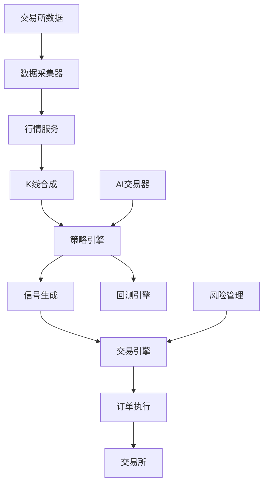

# 量化交易系统帮助文档

## 🚀 项目概述

这是一个**生产级量化交易系统**，专为Python新手和量化交易初学者设计。系统采用现代Python技术栈，提供完整的量化交易解决方案。

### ✨ 主要特性

- **多交易所支持**: 支持币安、OKX等主流交易所
- **实时行情**: 支持Tick、K线、深度数据
- **策略引擎**: 支持多策略并发运行
- **回测系统**: 完整的回测功能
- **风险控制**: 内置风险管理模块
- **AI交易**: 集成强化学习AI交易
- **Web API**: 提供RESTful API接口
- **监控告警**: 集成Prometheus监控

## 📋 快速开始

### 环境要求

- Python 3.11+
- PostgreSQL/TimescaleDB
- Redis
- Kafka (可选)

### 安装步骤

```bash
# 克隆项目
git clone <repository-url>
cd quant_trading_system

# 安装依赖
pip install -e .

# 安装开发依赖
pip install -e .[dev]

# 安装AI功能依赖
pip install -e .[ai]
```

### 配置系统

复制环境配置文件：

```bash
cp .env.example .env
```

编辑`.env`文件，配置数据库和交易所API：

```env
# 数据库配置
DB_TIMESCALE_HOST=localhost
DB_TIMESCALE_PORT=5432
DB_TIMESCALE_USER=quant
DB_TIMESCALE_PASSWORD=quant123

# 交易所API配置
BINANCE_API_KEY=your_api_key
BINANCE_API_SECRET=your_api_secret
```

## 🛠️ 使用方法

### 命令行工具

系统提供了强大的命令行工具：

```bash
# 查看所有命令
quant --help

# 启动API服务
quant serve --host 0.0.0.0 --port 8000 --reload

# 运行回测
quant backtest --strategy dual_ma --symbol BTC/USDT --start 2024-01-01 --end 2024-03-01

# 列出可用策略
quant list-strategies

# 列出技术指标
quant list-indicators

# 检查配置
quant check-config
```

### Web API接口

启动服务后访问：
- API文档: http://localhost:8000/docs
- Redoc文档: http://localhost:8000/redoc

主要API端点：

```bash
# 系统状态
GET /api/v1/system/health

# 行情数据
GET /api/v1/market/bars?symbol=BTC/USDT&timeframe=1h&limit=100

# 策略管理
POST /api/v1/strategy/start
POST /api/v1/strategy/stop

# 交易操作
POST /api/v1/trading/order
GET /api/v1/trading/positions

# 回测功能
POST /api/v1/backtest/run
```

## 📊 系统架构

### 核心模块

```
src/quant_trading_system/
├── core/           # 核心基础设施
│   ├── config.py   # 配置管理
│   ├── events.py   # 事件系统
│   └── logging.py  # 日志系统
├── services/       # 业务服务
│   ├── market/     # 行情服务
│   ├── strategy/   # 策略引擎
│   ├── trading/    # 交易引擎
│   ├── backtest/   # 回测引擎
│   ├── indicators/ # 技术指标
│   ├── risk/       # 风险管理
│   └── ai_trader/  # AI交易
├── api/            # Web API接口
├── strategies/     # 策略实现
└── models/         # 数据模型
```

### 数据流架构



## 📈 策略开发指南

### 策略基础结构

每个策略都需要继承`Strategy`基类：

```python
from quant_trading_system.services.strategy.base import Strategy
from quant_trading_system.services.strategy.signal import Signal

class MyStrategy(Strategy):
    name = "my_strategy"
    description = "我的自定义策略"
    
    def on_bar(self, bar):
        # 处理K线数据
        if self.should_buy(bar):
            return self.buy(bar.symbol, reason="买入信号")
        elif self.should_sell(bar):
            return self.sell(bar.symbol, reason="卖出信号")
```

### 内置策略示例

系统提供了多个示例策略：

1. **双均线策略** (`dual_ma`)
   - 快线上穿慢线时买入
   - 快线下穿慢线时卖出

2. **MACD策略** (`macd_cross`)
   - MACD金叉买入
   - MACD死叉卖出

3. **RSI策略** (`rsi_ob_os`)
   - RSI低于30超卖买入
   - RSI高于70超买卖出

4. **布林带策略** (`bollinger_band`)
   - 价格触及下轨买入
   - 价格触及上轨卖出

### 技术指标使用

策略中可以方便地使用技术指标：

```python
def on_bar(self, bar):
    # 计算移动平均线
    ma_result = self.calculate_indicator("SMA", period=20)
    ma_value = ma_result["sma"][-1]
    
    # 计算RSI
    rsi_result = self.calculate_indicator("RSI", period=14)
    rsi_value = rsi_result["rsi"][-1]
    
    # 交易逻辑...
```

## 🔧 配置说明

### 主要配置项

```python
# 环境配置
ENV=development  # development, testing, production
DEBUG=true

# 数据库配置
DB_TIMESCALE_HOST=localhost
DB_TIMESCALE_PORT=5432

# Redis配置
REDIS_HOST=localhost
REDIS_PORT=6379

# 交易配置
TRADING_ORDER_TIMEOUT=30
TRADING_DEFAULT_COMMISSION_RATE=0.0004

# 策略配置
STRATEGY_BACKTEST_START_CAPITAL=1000000.0
```

### 风险控制配置

系统内置了完善的风险控制：

- **最大仓位比例**: 限制单策略最大仓位
- **单笔订单限制**: 限制单笔订单规模
- **日亏损限制**: 控制每日最大亏损
- **最大回撤控制**: 防止过度亏损

## 🧪 测试与调试

### 运行测试

```bash
# 运行所有测试
pytest

# 运行特定模块测试
pytest tests/test_strategy.py

# 带覆盖率测试
pytest --cov=src tests/
```

### 调试策略

使用内置的调试工具：

```python
# 在策略中添加日志
import structlog
logger = structlog.get_logger(__name__)

def on_bar(self, bar):
    logger.info("处理K线", symbol=bar.symbol, close=bar.close)
    # 策略逻辑...
```

## 🚢 部署指南

### Docker部署

使用Docker Compose快速部署：

```bash
# 启动所有服务
docker-compose up -d

# 查看服务状态
docker-compose ps

# 查看日志
docker-compose logs -f
```

### 生产环境配置

1. **数据库配置**: 使用生产级数据库集群
2. **Redis配置**: 配置Redis集群和持久化
3. **监控配置**: 设置Prometheus和告警
4. **安全配置**: 配置SSL证书和防火墙

## 📚 学习资源

### 教程文件

项目包含完整的教程：

- `docs/tutorial/01_python_basics.py` - Python基础
- `docs/tutorial/02_quant_concepts.py` - 量化概念
- `docs/tutorial/03_project_walkthrough.py` - 项目详解
- `docs/tutorial/04_hands_on_practice.py` - 实践练习
- `docs/tutorial/05_interview_questions.py` - 面试问题

### 示例代码

查看`examples/`目录：

- `demo.py` - 基础使用示例
- `ai_trader_demo.py` - AI交易示例

## 🤝 贡献指南

### 开发流程

1. Fork项目
2. 创建特性分支
3. 提交更改
4. 推送到分支
5. 创建Pull Request

### 代码规范

- 使用Black进行代码格式化
- 使用Ruff进行代码检查
- 使用MyPy进行类型检查
- 编写单元测试

## 📞 技术支持

### 常见问题

1. **数据库连接失败**
   - 检查数据库服务是否启动
   - 验证连接配置是否正确

2. **API密钥错误**
   - 检查交易所API密钥配置
   - 验证网络连接和权限

3. **策略不执行**
   - 检查策略状态和订阅
   - 查看日志文件排查问题

### 获取帮助

- 查看项目文档
- 查看API文档
- 查看教程示例
- 提交Issue

## 📄 许可证

本项目采用MIT许可证 - 查看LICENSE文件了解详情。

---

**开始你的量化交易之旅吧！** 🎯

这个系统为你提供了从入门到精通的全套工具，无论你是Python新手还是量化交易初学者，都能快速上手并构建自己的交易策略。
