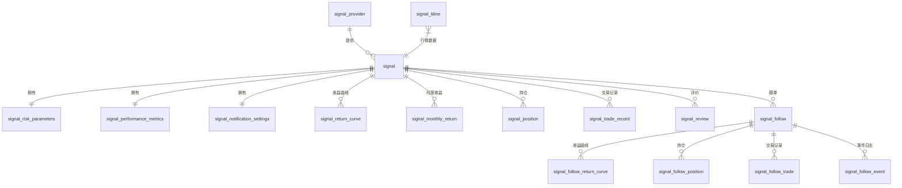

# 信号模块 - 数据库表结构与 API 接口设计

> 数据库：PostgreSQL + TimescaleDB  
> 文档版本：v1.1  
> 最后更新：2026-02-27  
> 本文档覆盖以下三个页面的数据需求：  
> 1. **信号列表页** (`SignalList.vue`) - 信号广场  
> 2. **信号详情页** (`SignalDetail.vue`) - 信号详情  
> 3. **信号跟单详情页** (`SignalFollowDetail.vue`) - 跟单运行详情
>
> **v1.1 更新说明：**  
> - signal 主表新增 `strategy_id`、`enable_flag` 字段，支持与策略系统关联  
> - 新增 `signal_follow_return_curve` 时序表，替代原 JSONB 存储收益曲线  
> - signal_follow_orders 新增 `signal_id`、`follow_days` 字段  
> - 统一 API 接口路径和参数命名风格  
> - 新增 `GET /signals/platforms` 和 `GET /signals/{id}/return-curve` 接口

---

## 一、数据库表结构设计

### 1. `signal` — 信号主表

存储信号的核心元数据信息。

```sql
CREATE TABLE signal (
    id                  BIGINT PRIMARY KEY,
    name                VARCHAR(128) NOT NULL,                          -- 信号名称，如 "Alpha Pro #1"
    platform            VARCHAR(64) NOT NULL DEFAULT 'Binance',         -- 来源平台，如 Binance、OKX
    type                VARCHAR(16) NOT NULL DEFAULT 'live',            -- 信号类型：live(实盘) / simulated(模拟盘)
    status              VARCHAR(16) NOT NULL DEFAULT 'running',         -- 信号状态：running / paused / stopped
    exchange            VARCHAR(64),                                    -- 交易所
    trading_pair        VARCHAR(32),                                    -- 交易对，如 BTC/USDT
    timeframe           VARCHAR(16),                                    -- 时间周期，如 15m、1H、4H、1D
    signal_frequency    VARCHAR(16),                                    -- 信号频率：high / medium / low
    description         TEXT,                                           -- 信号描述
    provider_id         BIGINT REFERENCES signal_providers(id),         -- 信号提供者ID
    strategy_id         VARCHAR(128),                                   -- 关联的策略ID（可选，如果信号由策略生成）
    followers_count     INTEGER NOT NULL DEFAULT 0,                     -- 跟随人数（冗余计数，定期同步）
    run_days            INTEGER NOT NULL DEFAULT 0,                     -- 运行天数
    cumulative_return   DECIMAL(12,4) NOT NULL DEFAULT 0,               -- 累计收益率(%)
    max_drawdown        DECIMAL(12,4) NOT NULL DEFAULT 0,               -- 最大回撤(%)
    created_at          TIMESTAMPTZ NOT NULL DEFAULT NOW(),
    updated_at          TIMESTAMPTZ NOT NULL DEFAULT NOW(),
    enable_flag         BOOLEAN DEFAULT TRUE                            -- 启用标志（软删除）
);

CREATE INDEX idx_signal_platform ON signal(platform);
CREATE INDEX idx_signal_type ON signal(type);
CREATE INDEX idx_signal_status ON signal(status);
CREATE INDEX idx_signal_provider ON signal(provider_id);
CREATE INDEX idx_signal_strategy ON signal(strategy_id);
CREATE INDEX idx_signal_cumulative_return ON signal(cumulative_return DESC);
CREATE INDEX idx_signal_followers ON signal(followers_count DESC);
CREATE INDEX idx_signal_enable ON signal(enable_flag);
```

### 2. `signal_risk_parameters` — 信号风险参数表

```sql
CREATE TABLE signal_risk_parameters (
    id                      BIGSERIAL PRIMARY KEY,
    signal_id               BIGINT NOT NULL UNIQUE REFERENCES signal(id) ON DELETE CASCADE,
    max_position_size       NUMERIC(8,2),       -- 最大仓位(%)
    stop_loss_percentage    NUMERIC(8,2),        -- 止损比例(%)
    take_profit_percentage  NUMERIC(8,2),        -- 止盈比例(%)
    risk_reward_ratio       NUMERIC(8,2),        -- 风险收益比
    volatility_filter       BOOLEAN DEFAULT FALSE, -- 波动率过滤开关
    created_at              TIMESTAMPTZ NOT NULL DEFAULT NOW(),
    updated_at              TIMESTAMPTZ NOT NULL DEFAULT NOW()
);
```

### 3. `signal_performance_metrics` — 信号绩效指标表

```sql
CREATE TABLE signal_performance_metrics (
    id                          BIGSERIAL PRIMARY KEY,
    signal_id                   BIGINT NOT NULL UNIQUE REFERENCES signal(id) ON DELETE CASCADE,
    sharpe_ratio                NUMERIC(8,4),       -- 夏普比率
    win_rate                    NUMERIC(8,4),        -- 胜率(%)
    profit_factor               NUMERIC(8,4),        -- 盈亏比
    average_holding_period      NUMERIC(8,2),        -- 平均持仓天数
    max_consecutive_losses      INT,                 -- 最大连亏次数
    total_trades                INT DEFAULT 0,       -- 总交易次数
    win_trades                  INT DEFAULT 0,       -- 盈利次数
    loss_trades                 INT DEFAULT 0,       -- 亏损次数
    avg_win                     NUMERIC(14,4),       -- 平均盈利金额
    avg_loss                    NUMERIC(14,4),       -- 平均亏损金额
    created_at                  TIMESTAMPTZ NOT NULL DEFAULT NOW(),
    updated_at                  TIMESTAMPTZ NOT NULL DEFAULT NOW()
);
```

### 4. `signal_notification_settings` — 信号通知设置表

```sql
CREATE TABLE signal_notification_settings (
    id                  BIGSERIAL PRIMARY KEY,
    signal_id           BIGINT NOT NULL UNIQUE REFERENCES signal(id) ON DELETE CASCADE,
    email_alerts        BOOLEAN DEFAULT TRUE,       -- 邮件提醒
    push_notifications  BOOLEAN DEFAULT TRUE,       -- 推送通知
    telegram_bot        BOOLEAN DEFAULT FALSE,      -- Telegram 机器人
    discord_webhook     BOOLEAN DEFAULT FALSE,      -- Discord Webhook
    alert_threshold     NUMERIC(8,2),               -- 提醒阈值(%)
    created_at          TIMESTAMPTZ NOT NULL DEFAULT NOW(),
    updated_at          TIMESTAMPTZ NOT NULL DEFAULT NOW()
);
```

### 5. `signal_return_curve` — 信号收益曲线（时序表）

使用 TimescaleDB 超表存储每日收益曲线数据。

```sql
CREATE TABLE signal_return_curve (
    signal_id       BIGINT NOT NULL REFERENCES signal(id) ON DELETE CASCADE,
    time            TIMESTAMPTZ NOT NULL,           -- 日期
    return_value    NUMERIC(12,4) NOT NULL,          -- 当日累计收益率(%)
    drawdown        NUMERIC(12,4),                   -- 当日回撤(%)
    PRIMARY KEY (signal_id, time)
);

-- 转为 TimescaleDB 超表
SELECT create_hypertable('signal_return_curve', 'time');

CREATE INDEX idx_signal_return_curve_signal ON signal_return_curve(signal_id, time DESC);
```

### 6. `signal_monthly_return` — 信号月度收益

```sql
CREATE TABLE signal_monthly_return (
    signal_id       BIGINT NOT NULL REFERENCES signal(id) ON DELETE CASCADE,
    month           DATE NOT NULL,                  -- 月份（取当月1日）
    return_value    NUMERIC(12,4) NOT NULL,          -- 月度收益率(%)
    PRIMARY KEY (signal_id, month)
);
```

### 7. `signal_position` — 信号当前持仓表

```sql
CREATE TABLE signal_position (
    id              BIGSERIAL PRIMARY KEY,
    signal_id       BIGINT NOT NULL REFERENCES signal(id) ON DELETE CASCADE,
    symbol          VARCHAR(32) NOT NULL,           -- 交易对
    side            VARCHAR(8) NOT NULL,             -- 方向：long / short
    amount          NUMERIC(18,8) NOT NULL,          -- 数量
    entry_price     NUMERIC(18,8) NOT NULL,          -- 开仓价
    current_price   NUMERIC(18,8),                   -- 当前价格（实时更新）
    pnl             NUMERIC(14,4),                   -- 盈亏金额
    pnl_percent     NUMERIC(10,4),                   -- 盈亏百分比(%)
    opened_at       TIMESTAMPTZ NOT NULL DEFAULT NOW(),
    updated_at      TIMESTAMPTZ NOT NULL DEFAULT NOW()
);

CREATE INDEX idx_signal_position_signal ON signal_position(signal_id);
```

### 8. `signal_trade_record` — 信号交易记录（历史信号）

```sql
CREATE TABLE signal_trade_record (
    id              BIGSERIAL PRIMARY KEY,
    signal_id       BIGINT NOT NULL REFERENCES signal(id) ON DELETE CASCADE,
    action          VARCHAR(8) NOT NULL,             -- buy / sell
    symbol          VARCHAR(32) NOT NULL,            -- 交易对
    price           NUMERIC(18,8) NOT NULL,          -- 成交价格
    amount          NUMERIC(18,8) NOT NULL,          -- 成交数量
    total           NUMERIC(18,4),                   -- 成交额
    strength        VARCHAR(8),                      -- 信号强度：强 / 中 / 弱
    pnl             NUMERIC(14,4),                   -- 盈亏金额（卖出时有值）
    traded_at       TIMESTAMPTZ NOT NULL,             -- 成交时间
    created_at      TIMESTAMPTZ NOT NULL DEFAULT NOW()
);

-- 转为 TimescaleDB 超表（按交易时间）
SELECT create_hypertable('signal_trade_record', 'traded_at');

CREATE INDEX idx_signal_trade_signal ON signal_trade_record(signal_id, traded_at DESC);
```

### 9. `signal_kline` — K线数据（时序表）

```sql
CREATE TABLE signal_kline (
    symbol          VARCHAR(32) NOT NULL,            -- 交易对
    exchange        VARCHAR(64) NOT NULL,            -- 交易所
    timeframe       VARCHAR(8) NOT NULL,             -- 时间周期：15m/1H/4H/1D/1W
    time            TIMESTAMPTZ NOT NULL,            -- K线时间
    open            NUMERIC(18,8) NOT NULL,
    high            NUMERIC(18,8) NOT NULL,
    low             NUMERIC(18,8) NOT NULL,
    close           NUMERIC(18,8) NOT NULL,
    volume          NUMERIC(24,8) NOT NULL DEFAULT 0,
    PRIMARY KEY (symbol, exchange, timeframe, time)
);

-- 转为 TimescaleDB 超表
SELECT create_hypertable('signal_kline', 'time');

CREATE INDEX idx_kline_symbol_tf ON signal_kline(symbol, exchange, timeframe, time DESC);
```

### 10. `signal_providers` — 信号提供者表

> 注：实际表名为 `signal_providers`（复数形式）

```sql
CREATE TABLE signal_providers (
    id              BIGSERIAL PRIMARY KEY,
    user_id         BIGINT,                          -- 关联系统用户ID（可选）
    name            VARCHAR(128) NOT NULL,           -- 名称
    avatar_url      VARCHAR(512),                    -- 头像URL
    bio             TEXT,                             -- 简介
    verified        BOOLEAN DEFAULT FALSE,           -- 是否认证
    total_signals   INT DEFAULT 0,                   -- 信号数
    avg_return      NUMERIC(10,4),                   -- 平均收益(%)
    total_followers INT DEFAULT 0,                   -- 总粉丝数
    rating          NUMERIC(4,2),                    -- 评分(5分制)
    experience      VARCHAR(32),                     -- 交易经验
    join_date       DATE,                            -- 入驻日期
    created_at      TIMESTAMPTZ NOT NULL DEFAULT NOW(),
    updated_at      TIMESTAMPTZ NOT NULL DEFAULT NOW()
);
```

### 11. `signal_review` — 用户评价表

```sql
CREATE TABLE signal_review (
    id              BIGSERIAL PRIMARY KEY,
    signal_id       BIGINT NOT NULL REFERENCES signal(id) ON DELETE CASCADE,
    user_id         BIGINT NOT NULL,                 -- 评价用户ID
    user_name       VARCHAR(128) NOT NULL,           -- 用户名（冗余）
    rating          SMALLINT NOT NULL CHECK (rating >= 1 AND rating <= 5), -- 评分 1-5
    content         TEXT NOT NULL,                    -- 评价内容
    likes           INT DEFAULT 0,                    -- 点赞数
    created_at      TIMESTAMPTZ NOT NULL DEFAULT NOW(),
    updated_at      TIMESTAMPTZ NOT NULL DEFAULT NOW()
);

CREATE INDEX idx_signal_review_signal ON signal_review(signal_id, created_at DESC);
CREATE INDEX idx_signal_review_user ON signal_review(user_id);
```

### 12. `signal_follow_orders` — 跟单记录主表

> 注：实际表名为 `signal_follow_orders`

存储用户的跟单配置和状态。

```sql
CREATE TABLE signal_follow_orders (
    id                  BIGSERIAL PRIMARY KEY,
    user_id             BIGINT NOT NULL,                         -- 跟单用户ID
    signal_id           BIGINT NOT NULL REFERENCES signal(id),   -- 信号ID
    signal_name         VARCHAR(128),                            -- 信号名称（冗余）
    exchange            VARCHAR(64),                             -- 交易所
    status              VARCHAR(16) NOT NULL DEFAULT 'following', -- 状态：following / stopped / paused
    follow_amount       NUMERIC(18,4) NOT NULL,                  -- 跟单资金 (USDT)
    current_value       NUMERIC(18,4),                           -- 当前净值 (USDT)
    follow_ratio        NUMERIC(6,4) NOT NULL DEFAULT 1.0,       -- 跟单比例
    stop_loss           NUMERIC(8,2),                            -- 止损百分比(%)
    total_return        NUMERIC(12,4) DEFAULT 0,                 -- 总收益率(%)
    today_return        NUMERIC(12,4) DEFAULT 0,                 -- 今日收益率(%)
    max_drawdown        NUMERIC(12,4) DEFAULT 0,                 -- 最大回撤(%)
    current_drawdown    NUMERIC(12,4) DEFAULT 0,                 -- 当前回撤(%)
    risk_level          VARCHAR(16),                             -- 持仓风险度：低 / 中等 / 高
    win_rate            NUMERIC(8,4) DEFAULT 0,                  -- 胜率(%)
    total_trades        INT DEFAULT 0,                           -- 总交易次数
    win_trades          INT DEFAULT 0,                           -- 盈利次数
    loss_trades         INT DEFAULT 0,                           -- 亏损次数
    avg_win             NUMERIC(14,4) DEFAULT 0,                 -- 平均盈利
    avg_loss            NUMERIC(14,4) DEFAULT 0,                 -- 平均亏损
    profit_factor       NUMERIC(8,4) DEFAULT 0,                  -- 盈亏比
    follow_days         INT DEFAULT 0,                           -- 跟单天数
    started_at          TIMESTAMPTZ NOT NULL DEFAULT NOW(),       -- 开始跟单时间
    stopped_at          TIMESTAMPTZ,                             -- 停止跟单时间
    created_at          TIMESTAMPTZ NOT NULL DEFAULT NOW(),
    updated_at          TIMESTAMPTZ NOT NULL DEFAULT NOW()
);

CREATE INDEX idx_signal_follow_user ON signal_follow(user_id, status);
CREATE INDEX idx_signal_follow_signal ON signal_follow(signal_id);
CREATE UNIQUE INDEX idx_signal_follow_active ON signal_follow(user_id, signal_id) WHERE status = 'following';
```

### 13. `signal_follow_return_curve` — 跟单收益曲线（时序表）

> 替代原来 signal_follow_orders 中的 JSONB 存储方式，便于大数据量时序查询

```sql
CREATE TABLE signal_follow_return_curve (
    follow_id       BIGINT NOT NULL REFERENCES signal_follow_orders(id) ON DELETE CASCADE,
    time            TIMESTAMPTZ NOT NULL,            -- 日期
    return_value    DECIMAL(12,4) NOT NULL,           -- 跟单累计收益率(%)
    signal_return   DECIMAL(12,4),                    -- 对应信号源的收益率(%)（用于收益对比）
    PRIMARY KEY (follow_id, time)
);

-- 转为 TimescaleDB 超表
SELECT create_hypertable('signal_follow_return_curve', 'time', if_not_exists => TRUE);

CREATE INDEX idx_follow_return_curve ON signal_follow_return_curve(follow_id, time DESC);
```

### 14. `signal_follow_positions` — 跟单持仓表

> 注：实际表名为 `signal_follow_positions`（复数形式）

```sql
CREATE TABLE signal_follow_positions (
    id              BIGSERIAL PRIMARY KEY,
    follow_id       BIGINT NOT NULL REFERENCES signal_follow(id) ON DELETE CASCADE,
    symbol          VARCHAR(32) NOT NULL,            -- 交易对
    side            VARCHAR(8) NOT NULL,              -- 方向：long / short
    amount          NUMERIC(18,8) NOT NULL,           -- 数量
    entry_price     NUMERIC(18,8) NOT NULL,           -- 开仓价
    current_price   NUMERIC(18,8),                    -- 当前价
    pnl             NUMERIC(14,4),                    -- 盈亏金额
    pnl_percent     NUMERIC(10,4),                    -- 盈亏百分比(%)
    opened_at       TIMESTAMPTZ NOT NULL DEFAULT NOW(),
    updated_at      TIMESTAMPTZ NOT NULL DEFAULT NOW()
);

CREATE INDEX idx_follow_position ON signal_follow_position(follow_id);
```

### 15. `signal_follow_trades` — 跟单交易记录

> 注：实际表名为 `signal_follow_trades`（复数形式）

```sql
CREATE TABLE signal_follow_trades (
    id              BIGSERIAL PRIMARY KEY,
    follow_id       BIGINT NOT NULL REFERENCES signal_follow(id) ON DELETE CASCADE,
    side            VARCHAR(8) NOT NULL,              -- buy / sell
    symbol          VARCHAR(32) NOT NULL,             -- 交易对
    price           NUMERIC(18,8) NOT NULL,           -- 成交价
    amount          NUMERIC(18,8) NOT NULL,           -- 成交数量
    total           NUMERIC(18,4),                    -- 成交额
    pnl             NUMERIC(14,4),                    -- 盈亏（卖出时有值）
    traded_at       TIMESTAMPTZ NOT NULL,              -- 成交时间
    created_at      TIMESTAMPTZ NOT NULL DEFAULT NOW()
);

-- 转为 TimescaleDB 超表
SELECT create_hypertable('signal_follow_trade', 'traded_at');

CREATE INDEX idx_follow_trade ON signal_follow_trade(follow_id, traded_at DESC);
```

### 16. `signal_follow_events` — 跟单事件日志

> 注：实际表名为 `signal_follow_events`（复数形式）

```sql
CREATE TABLE signal_follow_events (
    id              BIGSERIAL PRIMARY KEY,
    follow_id       BIGINT NOT NULL REFERENCES signal_follow(id) ON DELETE CASCADE,
    type            VARCHAR(16) NOT NULL,             -- 事件类型：trade / risk / success / error / system
    type_label      VARCHAR(32),                      -- 类型标签：交易 / 风控 / 成交 / 异常 / 系统
    message         TEXT NOT NULL,                    -- 事件消息
    event_time      TIMESTAMPTZ NOT NULL DEFAULT NOW(),
    created_at      TIMESTAMPTZ NOT NULL DEFAULT NOW()
);

CREATE INDEX idx_follow_event ON signal_follow_event(follow_id, event_time DESC);
```

---

## 二、ER 关系图



---

### 17. 其它补充表

#### `signal_reviews` — 用户评价表

已在 schema.sql 中实现，支持信号评分、评价内容、点赞功能。

#### `signal_review_likes` — 评价点赞表

已在 schema.sql 中实现，支持用户对评价的点赞/取消点赞。

#### `exchange_copy_accounts` — 交易所跟单账户表

已在 schema.sql 中实现，用于跟踪交易所真实账户的跟单。

---

## 三、API 接口设计

### 3.1 信号列表页接口

#### 3.1.1 获取信号列表（分页 + 筛选 + 排序）

- **请求方式**：`GET`
- **请求地址**：`/api/v1/signals/list`
- **请求参数（Query）**：

| 参数 | 类型 | 必填 | 说明 |
|------|------|------|------|
| page | int | 否 | 页码，默认1 |
| page_size | int | 否 | 每页数量，默认9 |
| platform | string | 否 | 来源平台筛选 |
| type | string | 否 | 信号类型：live / simulated |
| min_days | int | 否 | 最小运行天数 |
| search | string | 否 | 关键词搜索（模糊匹配信号名称） |
| sort_by | string | 否 | 排序方式：return_desc(默认) / return_asc / drawdown_asc / followers |

- **响应结果**：

```json
{
  "code": 0,
  "message": "success",
  "data": {
    "total": 50,
    "page": 1,
    "page_size": 9,
    "items": [
      {
        "id": 1,
        "name": "Alpha Pro #1",
        "platform": "Binance",
        "type": "live",
        "status": "running",
        "cumulative_return": 45.23,
        "max_drawdown": 12.50,
        "run_days": 120,
        "followers_count": 1234,
        "return_curve": [0.5, 1.2, 2.3, ...],
        "return_curve_labels": ["2025-01-01", "2025-01-02", ...]
      }
    ]
  }
}
```

#### 3.1.2 获取平台列表（筛选项）

- **请求方式**：`GET`
- **请求地址**：`/api/v1/signals/platforms`
- **请求参数**：无
- **响应结果**：

```json
{
  "code": 0,
  "message": "success",
  "data": ["Binance", "OKX", "Bybit", "Bitget", "Gate.io"]
}
```

---

### 3.2 信号详情页接口

#### 3.2.1 获取信号详情

- **请求方式**：`GET`
- **请求地址**：`/api/v1/signals/{signal_id}`
- **路径参数**：

| 参数 | 类型 | 必填 | 说明 |
|------|------|------|------|
| signal_id | int | 是 | 信号ID |

- **响应结果**：

```json
{
  "code": 0,
  "message": "success",
  "data": {
    "id": 1,
    "name": "Alpha Pro #1",
    "platform": "Binance",
    "type": "live",
    "status": "running",
    "exchange": "Binance",
    "trading_pair": "BTC/USDT",
    "timeframe": "1H",
    "signal_frequency": "medium",
    "description": "专注于BTC/USDT的中频交易信号...",
    "cumulative_return": 45.23,
    "max_drawdown": 12.50,
    "run_days": 120,
    "followers_count": 1234,
    "risk_parameters": {
      "max_position_size": 15.00,
      "stop_loss_percentage": 5.00,
      "take_profit_percentage": 10.00,
      "risk_reward_ratio": 2.00,
      "volatility_filter": true
    },
    "performance_metrics": {
      "sharpe_ratio": 1.85,
      "win_rate": 68.50,
      "profit_factor": 1.60,
      "average_holding_period": 5.5,
      "max_consecutive_losses": 3
    },
    "notification_settings": {
      "email_alerts": true,
      "push_notifications": true,
      "telegram_bot": false,
      "discord_webhook": false,
      "alert_threshold": 5.00
    },
    "provider": {
      "id": 1,
      "name": "CryptoMaster",
      "verified": true,
      "bio": "8年加密货币交易经验...",
      "total_signals": 12,
      "avg_return": 23.50,
      "total_followers": 8420,
      "rating": 4.6,
      "experience": "8年",
      "join_date": "2023-06-15"
    }
  }
}
```

#### 3.2.2 获取信号收益曲线

- **请求方式**：`GET`
- **请求地址**：`/api/v1/signals/{signal_id}/return-curve`
- **请求参数（Query）**：

| 参数 | 类型 | 必填 | 说明 |
|------|------|------|------|
| period | string | 否 | 时间范围：7d / 30d / 90d / 180d / all，默认 all |

- **响应结果**：

```json
{
  "code": 0,
  "message": "success",
  "data": {
    "return_curve": [0.5, 1.2, 2.3, 5.6, ...],
    "drawdown_curve": [0, -0.3, -0.1, -1.2, ...],
    "labels": ["2025-01-01", "2025-01-02", ...]
  }
}
```

#### 3.2.3 获取信号月度收益

- **请求方式**：`GET`
- **请求地址**：`/api/v1/signals/{signal_id}/monthly-returns`
- **请求参数（Query）**：

| 参数 | 类型 | 必填 | 说明 |
|------|------|------|------|
| months | int | 否 | 获取最近N个月的数据，默认12 |

- **响应结果**：

```json
{
  "code": 0,
  "message": "success",
  "data": {
    "returns": [5.2, -1.8, 8.3, 3.1, -4.5, 12.6, 7.8, -2.3, 6.4, 9.1, -0.8, 4.7],
    "labels": ["2024-03", "2024-04", "2024-05", ...],
    "stats": {
      "profit_months": 9,
      "loss_months": 3,
      "best_month": 12.6
    }
  }
}
```

#### 3.2.4 获取信号当前持仓

- **请求方式**：`GET`
- **请求地址**：`/api/v1/signals/{signal_id}/positions`
- **请求参数**：无
- **响应结果**：

```json
{
  "code": 0,
  "message": "success",
  "data": [
    {
      "id": 1,
      "symbol": "BTC/USDT",
      "side": "long",
      "amount": 0.055,
      "entry_price": 89234.50,
      "current_price": 91234.56,
      "pnl": 110.00,
      "pnl_percent": 2.24
    }
  ]
}
```

#### 3.2.5 获取信号交易记录

- **请求方式**：`GET`
- **请求地址**：`/api/v1/signals/{signal_id}/trades`
- **请求参数（Query）**：

| 参数 | 类型 | 必填 | 说明 |
|------|------|------|------|
| page | int | 否 | 页码，默认1 |
| page_size | int | 否 | 每页数量，默认20 |

- **响应结果**：

```json
{
  "code": 0,
  "message": "success",
  "data": {
    "total": 86,
    "items": [
      {
        "id": 1,
        "action": "buy",
        "symbol": "BTC/USDT",
        "price": 89234.50,
        "amount": 0.055,
        "total": 4907.90,
        "strength": "强",
        "pnl": null,
        "traded_at": "2025-02-25T14:30:00Z"
      }
    ]
  }
}
```

#### 3.2.6 获取K线数据

- **请求方式**：`GET`
- **请求地址**：`/api/v1/klines`
- **请求参数（Query）**：

| 参数 | 类型 | 必填 | 说明 |
|------|------|------|------|
| symbol | string | 是 | 交易对，如 BTC/USDT |
| exchange | string | 是 | 交易所 |
| timeframe | string | 是 | 时间周期：15m / 1H / 4H / 1D / 1W |
| limit | int | 否 | K线数量，默认200 |
| end_time | string | 否 | 截止时间（ISO 8601），默认当前时间 |

- **响应结果**：

```json
{
  "code": 0,
  "message": "success",
  "data": [
    {
      "time": 1708934400,
      "open": 91000.50,
      "high": 91500.00,
      "low": 90800.00,
      "close": 91234.56,
      "volume": 350.25
    }
  ]
}
```

#### 3.2.7 获取信号在K线上的买卖标记

- **请求方式**：`GET`
- **请求地址**：`/api/v1/signals/{signal_id}/trade-marks`
- **请求参数（Query）**：

| 参数 | 类型 | 必填 | 说明 |
|------|------|------|------|
| timeframe | string | 是 | 时间周期 |
| limit | int | 否 | 数量限制，默认200 |

- **响应结果**：

```json
{
  "code": 0,
  "message": "success",
  "data": [
    {
      "time": 1708934400,
      "position": "belowBar",
      "color": "#10b981",
      "shape": "arrowUp",
      "text": "买入"
    }
  ]
}
```

#### 3.2.8 获取信号评价列表

- **请求方式**：`GET`
- **请求地址**：`/api/v1/signals/{signal_id}/reviews`
- **请求参数（Query）**：

| 参数 | 类型 | 必填 | 说明 |
|------|------|------|------|
| page | int | 否 | 页码，默认1 |
| page_size | int | 否 | 每页数量，默认10 |

- **响应结果**：

```json
{
  "code": 0,
  "message": "success",
  "data": {
    "total": 25,
    "avg_rating": 4.6,
    "rating_distribution": {
      "5": 45,
      "4": 30,
      "3": 15,
      "2": 7,
      "1": 3
    },
    "items": [
      {
        "id": 1,
        "user_name": "Trader_John",
        "rating": 5,
        "content": "信号质量很高，跟单两个月了收益很稳定...",
        "likes": 24,
        "created_at": "2025-02-20T00:00:00Z"
      }
    ]
  }
}
```

#### 3.2.9 发表评价

- **请求方式**：`POST`
- **请求地址**：`/api/v1/signals/{signal_id}/reviews`
- **请求参数（Body JSON）**：

| 参数 | 类型 | 必填 | 说明 |
|------|------|------|------|
| rating | int | 是 | 评分 1-5 |
| content | string | 是 | 评价内容 |

- **响应结果**：

```json
{
  "code": 0,
  "message": "success",
  "data": {
    "id": 26,
    "rating": 5,
    "content": "...",
    "created_at": "2025-02-26T12:00:00Z"
  }
}
```

#### 3.2.10 评价点赞

- **请求方式**：`POST`
- **请求地址**：`/api/v1/signals/reviews/{review_id}/like`
- **请求参数**：无
- **响应结果**：

```json
{
  "code": 0,
  "message": "success",
  "data": {
    "likes": 25
  }
}
```

#### 3.2.11 创建跟单（启动跟单）

- **请求方式**：`POST`
- **请求地址**：`/api/v1/signals/{signal_id}/follow`
- **请求参数（Body JSON）**：

| 参数 | 类型 | 必填 | 说明 |
|------|------|------|------|
| amount | number | 是 | 跟单资金 (USDT) |
| ratio | number | 是 | 跟单比例，如 1.0 / 0.5 / 0.25 / 2.0 |
| stop_loss | number | 否 | 止损百分比(%) |

- **响应结果**：

```json
{
  "code": 0,
  "message": "success",
  "data": {
    "follow_id": 1,
    "signal_id": 1,
    "signal_name": "Alpha Pro #1",
    "follow_amount": 5000,
    "follow_ratio": 1.0,
    "stop_loss": 15,
    "status": "following",
    "started_at": "2025-02-26T12:00:00Z"
  }
}
```

---

### 3.3 跟单详情页接口

#### 3.3.1 获取跟单详情

- **请求方式**：`GET`
- **请求地址**：`/api/v1/follows/{follow_id}`
- **路径参数**：

| 参数 | 类型 | 必填 | 说明 |
|------|------|------|------|
| follow_id | int | 是 | 跟单记录ID |

- **响应结果**：

```json
{
  "code": 0,
  "message": "success",
  "data": {
    "id": 1,
    "signal_id": 1,
    "signal_name": "Alpha Pro #1",
    "exchange": "Binance",
    "status": "following",
    "total_return": 15.23,
    "follow_amount": 5000,
    "current_value": 5761.50,
    "max_drawdown": 8.45,
    "follow_days": 45,
    "current_price": 91234.56,
    "price_change_24h": 2.34,
    "volume_24h": "12.5B",
    "today_return": 1.23,
    "win_rate": 68.50,
    "follow_ratio": 1.0,
    "stop_loss": 15,
    "started_at": "2025-11-01T10:30:00Z",
    "current_drawdown": 3.21,
    "risk_level": "中等",
    "total_trades": 156,
    "win_trades": 107,
    "loss_trades": 49,
    "avg_win": 125.50,
    "avg_loss": 78.30,
    "profit_factor": 1.60
  }
}
```

#### 3.3.2 获取跟单收益曲线（含信号源对比）

- **请求方式**：`GET`
- **请求地址**：`/api/v1/follows/{follow_id}/return-curve`
- **请求参数（Query）**：

| 参数 | 类型 | 必填 | 说明 |
|------|------|------|------|
| period | string | 否 | 时间范围：7d / 30d / 90d / all，默认 all |

- **响应结果**：

```json
{
  "code": 0,
  "message": "success",
  "data": {
    "follow_return_curve": [0.5, 1.2, 2.3, ...],
    "signal_return_curve": [0.8, 1.5, 2.8, ...],
    "labels": ["2025-01-01", "2025-01-02", ...],
    "stats": {
      "return_diff": -1.23,
      "avg_slippage": 0.12,
      "copy_rate": 98.7
    }
  }
}
```

#### 3.3.3 获取跟单当前持仓

- **请求方式**：`GET`
- **请求地址**：`/api/v1/follows/{follow_id}/positions`
- **请求参数**：无
- **响应结果**：

```json
{
  "code": 0,
  "message": "success",
  "data": {
    "positions": [
      {
        "id": 1,
        "symbol": "BTC/USDT",
        "side": "long",
        "amount": 0.055,
        "entry_price": 89234.50,
        "current_price": 91234.56,
        "pnl": 110.00,
        "pnl_percent": 2.24
      }
    ],
    "position_distribution": [
      { "name": "BTC/USDT", "value": 4907.90 },
      { "name": "ETH/USDT", "value": 4908.63 },
      { "name": "可用资金", "value": 853.47 }
    ],
    "capital_usage_rate": 85.2
  }
}
```

#### 3.3.4 获取跟单交易记录

- **请求方式**：`GET`
- **请求地址**：`/api/v1/follows/{follow_id}/trades`
- **请求参数（Query）**：

| 参数 | 类型 | 必填 | 说明 |
|------|------|------|------|
| page | int | 否 | 页码，默认1 |
| page_size | int | 否 | 每页数量，默认20 |

- **响应结果**：

```json
{
  "code": 0,
  "message": "success",
  "data": {
    "total": 156,
    "items": [
      {
        "id": 1,
        "side": "buy",
        "symbol": "BTC/USDT",
        "price": 89234.50,
        "amount": 0.055,
        "total": 4907.90,
        "pnl": null,
        "traded_at": "2025-02-20T14:30:00Z"
      }
    ]
  }
}
```

#### 3.3.5 获取跟单最近交易点位

- **请求方式**：`GET`
- **请求地址**：`/api/v1/follows/{follow_id}/trading-points`
- **请求参数（Query）**：

| 参数 | 类型 | 必填 | 说明 |
|------|------|------|------|
| limit | int | 否 | 返回数量，默认10 |

- **响应结果**：

```json
{
  "code": 0,
  "message": "success",
  "data": [
    {
      "id": 1,
      "type": "buy",
      "symbol": "BTC/USDT",
      "price": 89234.50,
      "amount": 0.055,
      "time": "2025-02-20T14:30:00Z"
    }
  ]
}
```

#### 3.3.6 获取跟单K线数据（含买卖标记）

- **请求方式**：`GET`
- **请求地址**：`/api/v1/follows/{follow_id}/kline`
- **请求参数（Query）**：

| 参数 | 类型 | 必填 | 说明 |
|------|------|------|------|
| timeframe | string | 是 | 时间周期：15m / 1H / 4H / 1D / 1W |
| limit | int | 否 | K线数量，默认200 |

- **响应结果**：

```json
{
  "code": 0,
  "message": "success",
  "data": {
    "klines": [
      {
        "time": 1708934400,
        "open": 91000.50,
        "high": 91500.00,
        "low": 90800.00,
        "close": 91234.56,
        "volume": 350.25
      }
    ],
    "trade_marks": [
      {
        "time": 1708934400,
        "position": "belowBar",
        "color": "#10b981",
        "shape": "arrowUp",
        "text": "买入"
      }
    ]
  }
}
```

#### 3.3.7 获取跟单事件日志

- **请求方式**：`GET`
- **请求地址**：`/api/v1/follows/{follow_id}/events`
- **请求参数（Query）**：

| 参数 | 类型 | 必填 | 说明 |
|------|------|------|------|
| page | int | 否 | 页码，默认1 |
| page_size | int | 否 | 每页数量，默认20 |
| type | string | 否 | 事件类型筛选：trade / risk / success / error / system |

- **响应结果**：

```json
{
  "code": 0,
  "message": "success",
  "data": {
    "total": 42,
    "items": [
      {
        "id": 1,
        "type": "trade",
        "type_label": "交易",
        "message": "跟单买入 BTC/USDT 0.055个，成交价 $89,234.50",
        "event_time": "2025-02-20T14:30:12Z"
      }
    ]
  }
}
```

#### 3.3.8 调整跟单设置

- **请求方式**：`PUT`
- **请求地址**：`/api/v1/follows/{follow_id}/settings`
- **请求参数（Body JSON）**：

| 参数 | 类型 | 必填 | 说明 |
|------|------|------|------|
| follow_amount | number | 否 | 跟单资金 |
| follow_ratio | number | 否 | 跟单比例 |
| stop_loss | number | 否 | 止损百分比(%) |

- **响应结果**：

```json
{
  "code": 0,
  "message": "success",
  "data": {
    "follow_id": 1,
    "follow_amount": 8000,
    "follow_ratio": 1.0,
    "stop_loss": 12,
    "updated_at": "2025-02-26T12:00:00Z"
  }
}
```

#### 3.3.9 停止跟单

- **请求方式**：`POST`
- **请求地址**：`/api/v1/follows/{follow_id}/stop`
- **请求参数**：无
- **响应结果**：

```json
{
  "code": 0,
  "message": "success",
  "data": {
    "follow_id": 1,
    "status": "stopped",
    "stopped_at": "2025-02-26T12:00:00Z",
    "final_return": 15.23,
    "final_value": 5761.50
  }
}
```

---

## 四、接口总览

| 序号 | 模块 | 方法 | 接口地址 | 说明 | 鉴权 |
|------|------|------|----------|------|------|
| 1 | 信号列表 | GET | `/api/v1/signals/list` | 获取信号列表（分页/筛选/排序） | 否 |
| 2 | 信号列表 | GET | `/api/v1/signals/platforms` | 获取平台列表 | 否 |
| 3 | 信号详情 | GET | `/api/v1/signals/{signal_id}` | 获取信号详情 | 可选 |
| 4 | 信号详情 | GET | `/api/v1/signals/{signal_id}/return-curve` | 获取收益曲线 | 否 |
| 5 | 信号详情 | GET | `/api/v1/signals/{signal_id}/monthly-returns` | 获取月度收益 | 否 |
| 6 | 信号详情 | GET | `/api/v1/signals/{signal_id}/drawdown` | 获取回撤分析 | 否 |
| 7 | 信号详情 | GET | `/api/v1/signals/{signal_id}/history` | 获取信号历史记录 | 可选 |
| 8 | 信号详情 | GET | `/api/v1/signals/{signal_id}/provider` | 获取信号提供者信息 | 否 |
| 9 | 信号详情 | GET | `/api/v1/signals/{signal_id}/reviews` | 获取评价列表 | 否 |
| 10 | 信号详情 | POST | `/api/v1/signals/{signal_id}/reviews` | 发表评价 | 是 |
| 11 | 信号详情 | POST | `/api/v1/signals/{signal_id}/reviews/{review_id}/like` | 评价点赞 | 是 |
| 12 | 信号详情 | POST | `/api/v1/signals/{signal_id}/follow` | 创建/启动跟单 | 是 |
| 13 | K线数据 | GET | `/api/v1/market/kline` | 获取K线行情数据 | 否 |
| 14 | 跟单详情 | GET | `/api/v1/follows/{follow_id}` | 获取跟单详情 | 是 |
| 15 | 跟单详情 | GET | `/api/v1/follows/{follow_id}/comparison` | 获取跟单收益对比数据 | 是 |
| 16 | 跟单详情 | GET | `/api/v1/follows/{follow_id}/positions` | 获取跟单持仓(含仓位分布) | 是 |
| 17 | 跟单详情 | GET | `/api/v1/follows/{follow_id}/trades` | 获取跟单交易记录 | 是 |
| 18 | 跟单详情 | GET | `/api/v1/follows/{follow_id}/events` | 获取事件日志 | 是 |
| 19 | 跟单详情 | PUT | `/api/v1/follows/{follow_id}/config` | 更新跟单配置 | 是 |
| 20 | 跟单详情 | POST | `/api/v1/follows/{follow_id}/stop` | 停止跟单 | 是 |
| 21 | 订阅管理 | GET | `/api/v1/signals/subscriptions` | 获取我的订阅列表 | 是 |
| 22 | 订阅管理 | POST | `/api/v1/signals/subscribe` | 订阅信号通知 | 是 |
| 23 | 订阅管理 | DELETE | `/api/v1/signals/subscriptions/{id}` | 取消订阅 | 是 |

---

## 五、TimescaleDB 超表说明

以下表被设置为 TimescaleDB 超表，适合高频写入和时间范围查询：

| 表名 | 时间列 | 用途 |
|------|--------|------|
| `signal_return_curve` | time | 信号每日收益曲线，按时间分区，支持高效的时间范围聚合 |
| `signal_trade_record` | traded_at | 信号交易记录，按交易时间分区 |
| `signal_kline` | time | K线行情数据，高频写入的核心时序数据 |
| `signal_follow_return_curve` | time | 跟单收益曲线，含信号源收益对比数据 |
| `signal_follow_trades` (TimescaleDB可选) | trade_time | 跟单交易记录，当数据量大时可转换为超表 |

建议对超表配置数据保留策略：

```sql
-- K线数据保留1年
SELECT add_retention_policy('signal_kline', INTERVAL '1 year');

-- 收益曲线保留2年
SELECT add_retention_policy('signal_return_curve', INTERVAL '2 years');
SELECT add_retention_policy('signal_follow_return_curve', INTERVAL '2 years');

-- 交易记录保留3年
SELECT add_retention_policy('signal_trade_record', INTERVAL '3 years');
SELECT add_retention_policy('signal_follow_trade', INTERVAL '3 years');
```

---

## 六、备注

1. 所有写操作接口均需要在请求头中携带 `Authorization: Bearer <token>` 进行身份验证
2. 跟单相关接口（`/api/v1/follows/*`）仅允许跟单所有者访问
3. 信号列表和详情为公开接口，创建跟单、发表评价等写操作需要登录
4. K线数据建议通过 WebSocket 实现实时推送，REST 接口作为历史数据补全
5. `followers_count` 等冗余字段通过定时任务或触发器同步更新
6. **数据查询策略**：信号详情、列表、收益曲线等接口从 `signal` 主表及关联的 `signal_trade_record` 表查询
7. 表名统一使用复数形式（如 `signal_providers`、`signal_follow_orders`、`signal_follow_positions` 等），与 ORM 模型保持一致
8. `signal` 主表通过 `strategy_id` 字段关联策略系统，支持策略自动生成信号源
