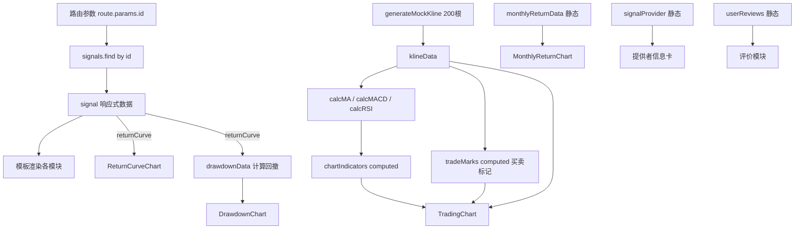
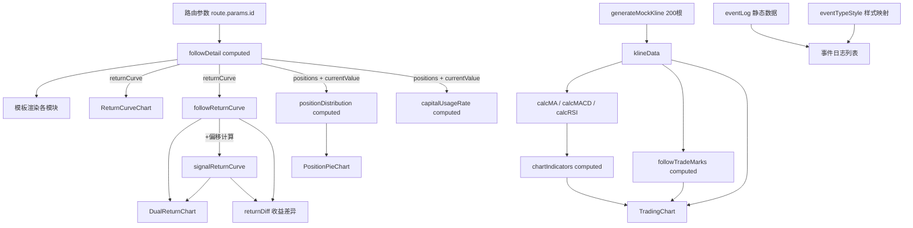

# 信号详情 & 信号跟单详情 — 页面说明文档

> 文档版本：v1.0  
> 最后更新：2026-02-26  
> 对应文件：  
> - `src/views/signal/SignalDetail.vue` — 信号详情页  
> - `src/views/user/SignalFollowDetail.vue` — 信号跟单详情页

---

## 目录

- [1. 页面概述](#1-页面概述)
- [2. 信号详情页 (SignalDetail)](#2-信号详情页-signaldetail)
  - [2.1 页面路由](#21-页面路由)
  - [2.2 功能模块总览](#22-功能模块总览)
  - [2.3 各模块详细说明](#23-各模块详细说明)
  - [2.4 组件依赖](#24-组件依赖)
  - [2.5 数据流](#25-数据流)
- [3. 信号跟单详情页 (SignalFollowDetail)](#3-信号跟单详情页-signalfollowdetail)
  - [3.1 页面路由](#31-页面路由)
  - [3.2 功能模块总览](#32-功能模块总览)
  - [3.3 各模块详细说明](#33-各模块详细说明)
  - [3.4 组件依赖](#34-组件依赖)
  - [3.5 数据流](#35-数据流)
- [4. 公共图表组件说明](#4-公共图表组件说明)
- [5. 页面对比](#5-页面对比)

---

## 1. 页面概述

**信号详情页**和**信号跟单详情页**是信号广场模块的两个核心页面，面向不同用户角色和使用场景：

| 页面 | 使用场景 | 核心目标 |
|------|---------|---------|
| 信号详情页 | 用户浏览信号广场，点击某个信号查看详情 | 帮助用户了解信号质量，决定是否跟单 |
| 信号跟单详情页 | 用户已跟单，进入"我的账户"查看跟单状态 | 帮助用户监控跟单表现，管理风控 |

---

## 2. 信号详情页 (SignalDetail)

### 2.1 页面路由

```
路径: /system/signals/:id
文件: src/views/signal/SignalDetail.vue
参数: id — 信号唯一标识
```

### 2.2 功能模块总览

页面采用 **左主右侧** 的三栏布局（左侧 `lg:col-span-2`，右侧 `lg:col-span-1`）：

```
┌──────────────────────────────────────────────────────────────┐
│ 面包屑导航 (信号广场 > 信号名称)                               │
├───────────────────────────────────┬──────────────────────────┤
│                                   │                          │
│  ① 信号头部信息卡                  │  ⑬ 跟单设置面板           │
│  ② K线行情与交易信号图             │     - 跟单资金            │
│  ③ 最近信号记录                    │     - 跟单比例            │
│  ④ 信号提供者信息                  │     - 止损设置            │
│  ⑤ 风险参数                       │     - 启动跟单按钮        │
│  ⑥ 绩效指标                       │                          │
│  ⑦ 通知设置                       │                          │
│  ⑧ 月度收益分布                    │                          │
│  ⑨ 回撤分析                       │                          │
│  ⑩ 收益表现 + 收益曲线             │                          │
│  ⑪ 当前持仓                       │                          │
│  ⑫ 用户评价                       │                          │
│                                   │                          │
└───────────────────────────────────┴──────────────────────────┘
```

### 2.3 各模块详细说明

#### ① 信号头部信息卡

| 元素 | 说明 |
|------|------|
| 信号图标 | 渐变色圆角图标，使用 `Radio` 图标 |
| 信号名称 | `signal.name`，如 "Alpha Trend v2" |
| 平台标签 | `signal.platform`，如 "Binance" |
| 类型标签 | `live`（实盘）/ `demo`（模拟盘），不同颜色区分 |
| 状态指示器 | `StatusDot` 组件，显示运行/暂停/停止状态 |
| 跟随人数 | 右上角显示 `signal.followers` |
| 信号描述 | `signal.description` 文字说明 |
| 交易所信息 | 交易所、交易对、时间周期、信号频率（高/中/低频） |

#### ② K线行情与交易信号图

这是页面的核心图表模块，使用 **`TradingChart`** 组件（基于 `lightweight-charts` v5.1 开源金融图表库）。

**功能特性：**
- **K线蜡烛图**：200根模拟K线数据，支持缩放和平移
- **成交量柱状图**：底部显示每根K线对应的成交量
- **时间周期切换**：`15m` / `1H` / `4H` / `1D` / `1W`
- **技术指标叠加**：
  - `MA`（移动平均线）：MA7（橙色）、MA25（蓝色）、MA99（紫色）
  - `MACD`：DIF线（蓝色）、DEA线（橙色）、柱状图（绿/红）
  - `RSI`：相对强弱指标（粉色）
- **买卖点标记**：绿色向上箭头（买入）、红色向下箭头（卖出）
- **图例说明**：底部显示各标记和指标的颜色图例

**交互：**
- 点击时间周期按钮切换K线周期
- 点击指标按钮切换指标显示/隐藏（激活态有主题色高亮）
- 十字光标跟踪鼠标位置

#### ③ 最近信号记录

展示信号最近发出的交易信号列表，每条记录包含：

| 字段 | 说明 |
|------|------|
| 操作方向 | 买入（绿色↑）/ 卖出（红色↓） |
| 交易对 | 如 BTC/USDT、ETH/USDT |
| 价格 | 成交价格 |
| 数量 | 交易数量 |
| 时间 | 信号发出时间 |
| 信号强度 | 强/中/弱 |
| 盈亏 | 已平仓信号显示盈亏金额，持仓中显示"持仓中" |

#### ④ 信号提供者信息

展示信号创建者/提供者的详细资料：

| 元素 | 说明 |
|------|------|
| 头像 | 渐变色圆形头像，显示名称首字母 |
| 昵称 | 提供者名称 |
| 认证标识 | "认证交易员"绿色徽章（如已认证） |
| 简介 | 提供者的个人简介 |
| 统计数据 | 信号数、平均收益、总粉丝、评分（4列网格） |
| 底部信息 | 入驻时间、交易经验 |

#### ⑤ 风险参数

以 2×3 网格展示信号的风控配置：

- 最大仓位比例（%）
- 止损比例（%）
- 止盈比例（%）
- 风险收益比（如 2:1）
- 波动率过滤（启用/禁用）

#### ⑥ 绩效指标

以 2×3 网格展示专业量化指标：

- 夏普比率 (Sharpe Ratio)
- 胜率 (Win Rate)
- 盈亏比 (Profit Factor)
- 平均持仓时间
- 最大连续亏损次数

#### ⑦ 通知设置

以 2×3 网格展示可配置的通知方式：

- 邮件提醒（启用/禁用）
- 推送通知（启用/禁用）
- Telegram 机器人（启用/禁用）
- Discord Webhook（启用/禁用）
- 提醒阈值（%）

#### ⑧ 月度收益分布

使用 **`MonthlyReturnChart`** 组件（ECharts 柱状图）展示近12个月的收益分布：

- **柱状图**：正收益为绿色柱，负收益为红色柱
- **统计摘要**：盈利月份数、亏损月份数、最佳月份收益

#### ⑨ 回撤分析

使用 **`DrawdownChart`** 组件（ECharts 面积图）展示回撤水下曲线：

- **面积图**：红色填充区域表示回撤深度
- **标线**：虚线标记最大回撤位置
- **统计摘要**：当前回撤、最大回撤、平均回撤

**计算逻辑：**
```
回撤 = 当前净值 - 历史最高净值
从收益曲线数据实时计算，追踪 peak（历史最高点）
```

#### ⑩ 收益表现 + 收益曲线

- **四大指标卡片**：累计收益率、最大回撤、运行天数、跟随人数
- **收益曲线图**：使用 `ReturnCurveChart` 组件（ECharts 线性面积图），正收益绿色/负收益红色

#### ⑪ 当前持仓

以表格形式展示信号当前的持仓信息（只读）：

| 列 | 说明 |
|----|------|
| 交易对 | 如 BTC/USDT |
| 方向 | 做多（绿标签）/ 做空（红标签） |
| 数量 | 持仓数量 |
| 开仓价 | 入场价格 |
| 现价 | 当前市场价 |
| 盈亏 | 浮动盈亏百分比（绿/红色） |

#### ⑫ 用户评价

包含两部分：

**评分概览区：**
- 总评分（如 4.6，大号字体）
- 5星可视化（填充星）
- 评价数量
- 1~5星分布比例条

**评价列表：**
- 用户头像（首字母圆形）
- 用户名、日期
- 星级评分
- 评价文字内容
- 点赞按钮和计数

#### ⑬ 跟单设置面板（侧边栏）

右侧 `sticky` 固定面板：

| 元素 | 说明 |
|------|------|
| 跟单资金 | 数字输入框，单位 USDT |
| 跟单比例 | 下拉选择：100%/50%/25%/200% |
| 止损设置 | 数字输入框，单位 % |
| 配置预览 | 只读展示当前配置摘要 |
| 启动跟单按钮 | 主操作按钮（绿色渐变） |
| 风险提示 | "跟单有风险，请合理配置资金" |

### 2.4 组件依赖

```
SignalDetail.vue
├── StatusDot                  # 状态指示点
├── TradingChart               # K线+指标+买卖点 (lightweight-charts)
├── ReturnCurveChart           # 收益曲线 (ECharts)
├── MonthlyReturnChart         # 月度收益分布 (ECharts)
├── DrawdownChart              # 回撤水下曲线 (ECharts)
├── lucide-vue-next icons      # 20+ 图标
└── TDesign (t-input, t-select, t-option)  # 表单组件
```

### 2.5 数据流



---

## 3. 信号跟单详情页 (SignalFollowDetail)

### 3.1 页面路由

```
路径: /system/user/follow/:id
文件: src/views/user/SignalFollowDetail.vue
参数: id — 跟单记录唯一标识
```

### 3.2 功能模块总览

同样采用 **左主右侧** 三栏布局：

```
┌──────────────────────────────────────────────────────────────┐
│ 面包屑导航 (我的账户 > 信号名称)                               │
├──────────────────────────────────────────────────────────────┤
│ 跟单头部信息 + 5大关键指标 (总收益/跟单资金/当前净值/回撤/天数)  │
├───────────────────────────────────┬──────────────────────────┤
│                                   │                          │
│  ① 行情与交易点 (K线图)            │  ⑧ 跟单配置               │
│  ② 收益曲线                       │  ⑨ 仓位分布饼图           │
│  ③ 跟单 vs 信号源收益对比          │  ⑩ 风险提示               │
│  ④ 当前持仓表格                    │  ⑪ 绩效统计               │
│  ⑤ 交易记录                       │                          │
│  ⑥ 事件日志                       │                          │
│                                   │                          │
└───────────────────────────────────┴──────────────────────────┘
```

### 3.3 各模块详细说明

#### 头部信息卡

| 元素 | 说明 |
|------|------|
| 信号图标 | 渐变色圆角图标 |
| 信号名称 | 如 "Alpha Pro #1" |
| 交易所 | 如 "Binance" |
| 状态标签 | "跟单中"（蓝色标签） |
| StatusDot | 状态圆点指示器 |
| 操作按钮 | "调整设置" + "停止跟单"（红色危险按钮） |

**5大关键指标卡片（横向排列）：**

| 指标 | 颜色 | 说明 |
|------|------|------|
| 总收益率 | 绿/红 | 跟单以来累计收益百分比 |
| 跟单资金 | 白色 | 初始投入的 USDT 金额 |
| 当前净值 | 白色 | 当前账户净值 |
| 最大回撤 | 琥珀色 | 历史最大回撤百分比 |
| 跟单天数 | 主题蓝 | 跟单持续天数 |

#### ① 行情与交易点

与信号详情页类似的 K线综合图表，但增加了：

- **当前价格信息栏**：当前价格、24h涨跌、24h成交量
- **最近交易点位列表**：买入/卖出的具体价位、数量和时间

#### ② 收益曲线

使用 `ReturnCurveChart` 展示跟单以来的每日收益走势，下方有三项统计：
- 累计收益
- 今日收益
- 胜率

#### ③ 跟单 vs 信号源收益对比（新增）

使用 **`DualReturnChart`** 组件展示双线对比：

| 线条 | 样式 | 说明 |
|------|------|------|
| 我的跟单 | 绿色实线 + 面积填充 | 实际跟单收益 |
| 信号源 | 蓝色虚线 | 信号源原始收益 |

**统计指标：**
- **收益差异**：跟单收益 - 信号源收益（正值表示跟单更优）
- **平均滑点**：跟单执行滑点平均值
- **跟单复制率**：成功复制信号的比例

#### ④ 当前持仓表格

与信号详情页类似，但显示的是用户自己的跟单持仓，增加了：
- 盈亏金额列（$计价）
- 盈亏百分比列

#### ⑤ 交易记录

时间线式展示历史交易记录：

| 字段 | 说明 |
|------|------|
| 方向图标 | 买入（绿色↑）/ 卖出（红色↓） |
| 交易对 | 如 BTC/USDT |
| 时间 | 成交时间 |
| 价格 | 成交价格 |
| 数量 | 交易数量 |
| 成交额 | 价格 × 数量 |
| 盈亏 | 卖出时显示实际盈亏 |

#### ⑥ 事件日志（新增）

时间线式展示所有跟单相关事件：

| 事件类型 | 图标 | 颜色 | 示例 |
|---------|------|------|------|
| trade（交易） | Zap | 主题蓝 | "跟单买入 BTC/USDT 0.055个" |
| success（成交） | CheckCircle | 绿色 | "卖出 ETH/USDT 1.42个已成交" |
| risk（风控） | ShieldAlert | 琥珀色 | "当前回撤达到 3.21%" |
| error（异常） | XCircle | 红色 | "跟单延迟 2.3s 执行" |
| system（系统） | Settings | 蓝色 | "跟单参数更新" |

每条事件显示：类型图标、事件描述、时间戳、类型标签。

#### ⑧ 跟单配置（侧边栏）

`sticky` 固定面板，只读展示当前跟单配置：
- 跟单资金 (USDT)
- 跟单比例 (%)
- 止损设置 (%)
- 开始时间

#### ⑨ 仓位分布饼图（新增）

使用 **`PositionPieChart`** 组件（ECharts 环形饼图）：

- **环形饼图**：各交易对持仓金额占比 + 可用资金
- **中心文字**：总资产金额
- **资金使用率**：进度条展示已用/总资产比例

**计算逻辑：**
```
资金使用率 = Σ(持仓量 × 开仓价) / 当前净值 × 100%
可用资金 = 当前净值 - Σ(持仓量 × 开仓价)
```

#### ⑩ 风险提示

- 当前回撤值（琥珀色警告框）
- 距离止损的百分比差值
- 持仓风险度（低/中/高）

#### ⑪ 绩效统计

列表式展示完整绩效数据：
- 总交易次数
- 盈利次数 / 亏损次数
- 胜率
- 平均盈利 / 平均亏损
- 盈亏比 (Profit Factor)

### 3.4 组件依赖

```
SignalFollowDetail.vue
├── StatusDot                  # 状态指示点
├── TradingChart               # K线+指标+买卖点 (lightweight-charts)
├── ReturnCurveChart           # 收益曲线 (ECharts)
├── DualReturnChart            # 双线对比收益曲线 (ECharts)
├── PositionPieChart           # 仓位分布环形饼图 (ECharts)
└── lucide-vue-next icons      # 20+ 图标
```

### 3.5 数据流



---

## 4. 公共图表组件说明

### 4.1 TradingChart

| 属性 | 类型 | 说明 |
|------|------|------|
| 底层库 | `lightweight-charts` v5.1 | TradingView 开源金融图表库 |
| 文件 | `src/components/charts/TradingChart.vue` | |
| K线 | `KlineDataPoint[]` | time, open, high, low, close, volume |
| 指标 | `IndicatorData[]` | name, type(line/histogram), color, pane(main/sub/sub2), data |
| 买卖标记 | `TradeMarkData[]` | time, position, color, shape, text |

### 4.2 ReturnCurveChart

| 属性 | 类型 | 说明 |
|------|------|------|
| 底层库 | ECharts (vue-echarts) | |
| 文件 | `src/components/charts/ReturnCurveChart.vue` | |
| data | `number[]` | 收益率序列 |
| labels | `string[]` | X轴标签 |
| color | `string` | 线条颜色 |

### 4.3 DualReturnChart

| 属性 | 类型 | 说明 |
|------|------|------|
| 底层库 | ECharts (vue-echarts) | |
| 文件 | `src/components/charts/DualReturnChart.vue` | |
| data1 | `number[]` | 第一条线数据 |
| data2 | `number[]` | 第二条线数据 |
| name1/name2 | `string` | 图例名称 |
| color1/color2 | `string` | 线条颜色 |

### 4.4 MonthlyReturnChart

| 属性 | 类型 | 说明 |
|------|------|------|
| 底层库 | ECharts (vue-echarts) | |
| 文件 | `src/components/charts/MonthlyReturnChart.vue` | |
| data | `number[]` | 月度收益率序列 |
| labels | `string[]` | 月份标签 |
| 特点 | 正值绿色柱/负值红色柱 | |

### 4.5 DrawdownChart

| 属性 | 类型 | 说明 |
|------|------|------|
| 底层库 | ECharts (vue-echarts) | |
| 文件 | `src/components/charts/DrawdownChart.vue` | |
| data | `number[]` | 回撤序列（≤0的负数） |
| labels | `string[]` | X轴标签 |
| 特点 | 红色面积填充 + 最大回撤标线 | |

### 4.6 PositionPieChart

| 属性 | 类型 | 说明 |
|------|------|------|
| 底层库 | ECharts (vue-echarts) | |
| 文件 | `src/components/charts/PositionPieChart.vue` | |
| data | `Array<{name, value, color?}>` | 各仓位名称+金额 |
| 特点 | 环形饼图，中心显示总资产 | |

---

## 5. 页面对比

| 功能模块 | 信号详情页 | 跟单详情页 | 说明 |
|---------|:---------:|:---------:|------|
| 面包屑导航 | ✅ | ✅ | 不同起点（信号广场 / 我的账户） |
| 信号头部信息 | ✅ | ✅ | 跟单页多了操作按钮 |
| 5大关键指标 | ❌ | ✅ | 跟单页独有的指标概览 |
| K线+指标+买卖点 | ✅ | ✅ | 核心图表，两页共有 |
| 最近信号记录 | ✅ | ❌ | 信号详情页独有 |
| 信号提供者信息 | ✅ | ❌ | 信号详情页独有 |
| 风险参数 | ✅ | ❌ | 信号详情页独有 |
| 绩效指标 | ✅ | ❌ | 详情页用量化指标 |
| 通知设置 | ✅ | ❌ | 信号详情页独有 |
| 月度收益分布 | ✅ | ❌ | 信号详情页独有 |
| 回撤分析图 | ✅ | ❌ | 信号详情页独有 |
| 收益曲线 | ✅ | ✅ | 两页共有 |
| 跟单vs信号源对比 | ❌ | ✅ | 跟单页独有 |
| 当前持仓 | ✅(只读) | ✅(含盈亏) | 跟单页多了盈亏列 |
| 交易记录 | ❌ | ✅ | 跟单页独有 |
| 事件日志 | ❌ | ✅ | 跟单页独有 |
| 用户评价 | ✅ | ❌ | 信号详情页独有 |
| 跟单设置面板 | ✅(可编辑) | ✅(只读) | 详情页可配置+启动 |
| 仓位分布饼图 | ❌ | ✅ | 跟单页独有 |
| 风险提示 | ❌ | ✅ | 跟单页独有 |
| 绩效统计 | ❌ | ✅ | 跟单页用简单列表 |
