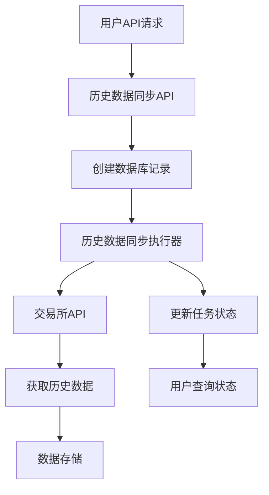

# 历史数据同步功能使用指南

## 概述

历史数据同步功能是量化交易系统的重要组成部分，它允许用户从各大交易所获取历史市场数据，用于策略回测、数据分析和模型训练。

### 功能特点

- **多交易所支持**: 支持Binance、OKX等主流交易所
- **多种数据类型**: K线、Ticker、深度、成交等数据
- **后台自动执行**: 任务创建后自动在后台执行
- **进度监控**: 实时监控任务执行进度
- **错误重试**: 自动重试机制确保任务完成

## 系统架构



## API接口文档

### 1. 创建历史数据同步任务

**接口**: `POST /api/v1/m/admin/historical-sync`

**请求体**:
```json
{
    "name": "BTC-ETH 7天历史K线数据同步",
    "exchange": "binance",
    "data_type": "kline",
    "symbols": ["BTCUSDT", "ETHUSDT"],
    "interval": "1h",
    "start_time": "2024-01-01T00:00:00",
    "end_time": "2024-01-08T00:00:00",
    "batch_size": 1000
}
```

**参数说明**:
- `name`: 任务名称，用于标识
- `exchange`: 交易所名称（binance, okx, bybit, bitget）
- `data_type`: 数据类型（kline, ticker, depth, trade）
- `symbols`: 交易对列表
- `interval`: K线周期（仅kline类型需要，如：1m, 5m, 15m, 1h, 4h, 1d）
- `start_time`: 开始时间（ISO格式）
- `end_time`: 结束时间（ISO格式）
- `batch_size`: 批次大小（1-5000）

### 2. 获取任务列表

**接口**: `GET /api/v1/m/admin/historical-sync`

**查询参数**:
- `exchange`: 按交易所筛选
- `data_type`: 按数据类型筛选
- `status`: 按状态筛选（pending, running, completed, failed, cancelled）
- `page`: 页码（默认1）
- `page_size`: 每页数量（默认20，最大100）

### 3. 获取任务详情

**接口**: `GET /api/v1/m/admin/historical-sync/{task_id}`

### 4. 取消任务

**接口**: `POST /api/v1/m/admin/historical-sync/{task_id}/cancel`

### 5. 执行器管理

**获取执行器状态**: `GET /api/v1/m/admin/historical-sync/status/executor`

**启动执行器**: `POST /api/v1/m/admin/historical-sync/executor/start`

**停止执行器**: `POST /api/v1/m/admin/historical-sync/executor/stop`

## 使用示例

### Python客户端示例

```python
import requests
import json
from datetime import datetime, timedelta

# API配置
BASE_URL = "http://localhost:8000"
HEADERS = {
    "Authorization": "Bearer your-jwt-token",
    "Content-Type": "application/json"
}

def create_sync_task():
    """创建历史数据同步任务"""
    url = f"{BASE_URL}/api/v1/m/admin/historical-sync"
    
    task_data = {
        "name": "BTC历史数据同步",
        "exchange": "binance",
        "data_type": "kline",
        "symbols": ["BTCUSDT"],
        "interval": "1h",
        "start_time": (datetime.utcnow() - timedelta(days=30)).isoformat(),
        "end_time": datetime.utcnow().isoformat(),
        "batch_size": 1000
    }
    
    response = requests.post(url, json=task_data, headers=HEADERS)
    result = response.json()
    
    if result["success"]:
        print(f"任务创建成功，ID: {result['data']['id']}")
        return result['data']['id']
    else:
        print(f"任务创建失败: {result.get('error', 'Unknown error')}")
        return None

def monitor_task(task_id):
    """监控任务进度"""
    url = f"{BASE_URL}/api/v1/m/admin/historical-sync/{task_id}"
    
    while True:
        response = requests.get(url, headers=HEADERS)
        result = response.json()
        
        if result["success"]:
            task = result["data"]
            print(f"状态: {task['status']}, 进度: {task['progress']}%")
            
            if task['status'] in ['completed', 'failed', 'cancelled']:
                break
        
        time.sleep(5)  # 每5秒检查一次

# 使用示例
if __name__ == "__main__":
    task_id = create_sync_task()
    if task_id:
        monitor_task(task_id)
```

### 命令行示例

```bash
# 创建任务
curl -X POST "http://localhost:8000/api/v1/m/admin/historical-sync" \
  -H "Authorization: Bearer your-jwt-token" \
  -H "Content-Type: application/json" \
  -d '{
    "name": "BTC历史数据同步",
    "exchange": "binance",
    "data_type": "kline",
    "symbols": ["BTCUSDT"],
    "interval": "1h",
    "start_time": "2024-01-01T00:00:00",
    "end_time": "2024-01-08T00:00:00",
    "batch_size": 1000
  }'

# 查看任务列表
curl -X GET "http://localhost:8000/api/v1/m/admin/historical-sync" \
  -H "Authorization: Bearer your-jwt-token"

# 查看执行器状态
curl -X GET "http://localhost:8000/api/v1/m/admin/historical-sync/status/executor" \
  -H "Authorization: Bearer your-jwt-token"
```

## 配置参数

### 执行器配置

执行器在系统启动时自动初始化，可以通过以下参数调整：

```python
# 在 HistoricalSyncExecutor 构造函数中
check_interval=30.0,      # 检查间隔（秒）
max_concurrent_tasks=3,   # 最大并发任务数
max_retries=3             # 最大重试次数
```

### 支持的交易所和数据格式

| 交易所 | 支持的数据类型 | 备注 |
|--------|---------------|------|
| Binance | K线数据 | 支持所有主流交易对 |
| OKX | K线数据 | 支持所有主流交易对 |
| Bybit | 待实现 | 计划支持 |
| Bitget | 待实现 | 计划支持 |

## 最佳实践

### 1. 任务规划

- **数据量控制**: 对于大量数据，建议分批次同步
- **时间范围**: 避免同步过长时间范围的数据，建议按周或月分批
- **并发控制**: 合理设置并发任务数，避免对交易所API造成压力

### 2. 错误处理

- **网络异常**: 执行器会自动重试，无需手动干预
- **API限制**: 遵守交易所API调用频率限制
- **数据格式**: 确保请求参数格式正确

### 3. 性能优化

- **批次大小**: 根据网络状况调整批次大小（建议100-1000）
- **并发数**: 根据服务器性能调整并发任务数
- **存储优化**: 定期清理已完成的任务记录

## 故障排除

### 常见问题

1. **任务一直处于pending状态**
   - 检查执行器是否正常运行
   - 查看系统日志确认执行器启动成功

2. **任务执行失败**
   - 检查网络连接
   - 验证API密钥和权限
   - 查看错误信息确定具体原因

3. **数据获取不完整**
   - 检查时间范围是否正确
   - 验证交易对格式
   - 确认交易所是否支持该交易对的历史数据

### 日志查看

执行器的运行日志可以在系统日志中查看：

```bash
# 查看系统日志
tail -f logs/system.log | grep HistoricalSyncExecutor
```

## 扩展开发

### 添加新的交易所支持

1. 实现对应的API客户端类（继承自BaseAPI）
2. 在`HistoricalSyncExecutor._get_api_client()`方法中添加支持
3. 更新配置验证规则

### 添加新的数据类型

1. 在`HistoricalSyncExecutor._sync_historical_data()`中添加处理逻辑
2. 实现对应的数据获取和存储方法
3. 更新API参数验证

## 相关文件

- `src/quant_trading_system/api/market/api/historical_sync.py` - API接口
- `src/quant_trading_system/services/market/historical_sync_executor.py` - 执行器
- `src/quant_trading_system/services/market/binance_api.py` - Binance API客户端
- `src/quant_trading_system/services/market/okx_api.py` - OKX API客户端
- `demo_historical_sync.py` - 演示脚本

## 版本历史

- v1.0.0 (2024-01-01): 初始版本，支持Binance和OKX的K线数据同步

---

**注意**: 使用历史数据同步功能需要有效的交易所API密钥和相应的权限。请确保遵守各交易所的使用条款和API调用限制。
