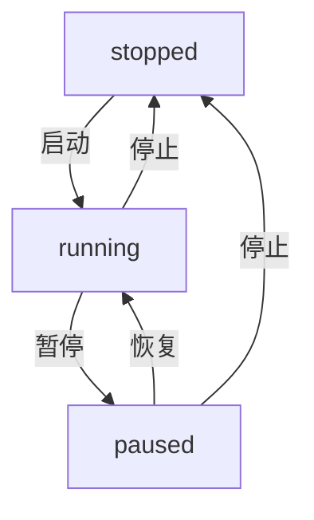
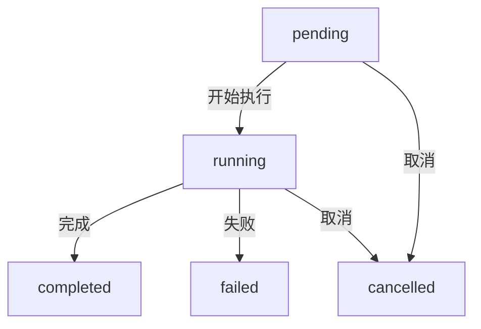

# 实时数据订阅管理API接口规范

## 📋 接口概览

### Admin端接口（/api/v1/m/）

#### 1. 订阅管理接口
- **前缀**: `/market/subscriptions`
- **功能**: 行情订阅配置的CRUD操作和状态控制

| 方法 | 路径 | 功能 | 描述 |
|------|------|------|------|
| POST | `/` | 创建订阅 | 创建新的数据订阅配置 |
| GET | `/` | 订阅列表 | 支持筛选分页的订阅列表 |
| GET | `/statistics` | 统计信息 | 各状态订阅数量和分布统计 |
| GET | `/{id}` | 订阅详情 | 获取指定订阅的完整信息 |
| PUT | `/{id}` | 更新订阅 | 修改订阅配置参数 |
| DELETE | `/{id}` | 删除订阅 | 删除订阅配置及相关任务 |
| POST | `/{id}/start` | 启动订阅 | 将订阅状态切换为运行中 |
| POST | `/{id}/pause` | 暂停订阅 | 将订阅状态切换为已暂停 |
| POST | `/{id}/stop` | 停止订阅 | 将订阅状态切换为已停止 |

#### 2. 手动同步任务接口
- **前缀**: `/market/sync-tasks`
- **功能**: 基于现有订阅的手动数据同步任务管理

| 方法 | 路径 | 功能 | 描述 |
|------|------|------|------|
| POST | `/` | 创建任务 | 为指定订阅创建手动同步任务 |
| GET | `/` | 任务列表 | 支持筛选分页的任务列表 |
| GET | `/{id}` | 任务详情 | 获取指定任务的完整信息 |
| POST | `/{id}/cancel` | 取消任务 | 取消待执行或执行中的任务 |

#### 3. 历史数据同步接口
- **前缀**: `/market/historical-sync`
- **功能**: 独立的历史数据同步任务管理（不依赖订阅）

| 方法 | 路径 | 功能 | 描述 |
|------|------|------|------|
| POST | `/` | 创建任务 | 创建独立的历史数据同步任务 |
| GET | `/` | 任务列表 | 支持筛选分页的任务列表 |
| GET | `/{id}` | 任务详情 | 获取指定任务的完整信息 |
| POST | `/{id}/cancel` | 取消任务 | 取消待执行或执行中的任务 |

### C端接口（/api/v1/c/）

#### 4. 市场数据接口
- **前缀**: `/market`
- **功能**: 普通用户访问市场行情数据

| 方法 | 路径 | 功能 | 描述 |
|------|------|------|------|
| POST | `/subscribe` | 订阅行情 | 订阅指定交易对的实时数据 |
| POST | `/unsubscribe` | 取消订阅 | 取消指定交易对的订阅 |
| GET | `/kline/{symbol}` | K线数据 | 获取历史K线数据 |
| GET | `/tick/{symbol}` | Tick数据 | 获取最新Tick数据 |
| GET | `/depth/{symbol}` | 深度数据 | 获取市场深度数据 |
| GET | `/symbols` | 交易对列表 | 获取已订阅的交易对列表 |
| GET | `/stats` | 统计信息 | 获取市场服务统计信息 |

## 🔧 数据模型

### 订阅配置模型（Subscription）
```python
class Subscription:
    id: str                    # 订阅ID
    name: str                  # 订阅名称
    exchange: str              # 交易所
    market_type: str          # 市场类型（spot/futures/margin）
    data_type: str            # 数据类型（kline/ticker/depth/trade/orderbook）
    symbols: list[str]         # 交易对列表
    interval: Optional[str]   # K线周期（仅kline类型需要）
    status: str               # 状态（running/paused/stopped）
    config: dict              # 高级配置
    total_records: int        # 总记录数
    error_count: int          # 错误计数
    last_error: str           # 最后错误信息
    created_at: datetime      # 创建时间
    updated_at: datetime      # 更新时间
    last_sync_time: datetime  # 最后同步时间
```

### 同步任务模型（SyncTask）
```python
class SyncTask:
    id: str                    # 任务ID
    subscription_id: str       # 关联订阅ID
    start_time: datetime       # 开始时间
    end_time: datetime        # 结束时间
    status: str               # 状态（pending/running/completed/failed/cancelled）
    progress: int             # 进度百分比
    total_records: int        # 总记录数
    synced_records: int       # 已同步记录数
    error_message: str        # 错误信息
    created_at: datetime      # 创建时间
    updated_at: datetime      # 更新时间
    completed_at: datetime    # 完成时间
```

### 历史同步任务模型（HistoricalSyncTask）
```python
class HistoricalSyncTask:
    id: str                    # 任务ID
    name: str                  # 任务名称
    exchange: str              # 交易所
    data_type: str            # 数据类型
    symbols: list[str]        # 交易对列表
    interval: Optional[str]   # K线周期
    start_time: datetime       # 开始时间
    end_time: datetime        # 结束时间
    batch_size: int           # 批次大小
    status: str               # 状态（pending/running/completed/failed/cancelled）
    progress: int             # 进度百分比
    total_records: int        # 总记录数
    synced_records: int       # 已同步记录数
    error_message: str        # 错误信息
    created_at: datetime      # 创建时间
    updated_at: datetime      # 更新时间
    completed_at: datetime    # 完成时间
```

## ✅ 验证规则

### 交易所验证
```python
VALID_EXCHANGES = {"Binance", "OKX", "Bybit", "Bitget", "binance", "okx", "bybit", "bitget"}
```

### 数据类型验证
```python
VALID_DATA_TYPES = {"kline", "ticker", "depth", "trade", "orderbook"}
```

### K线周期验证
```python
VALID_INTERVALS = {"1m", "5m", "15m", "1h", "4h", "1d"}
```

### 订阅状态验证
```python
VALID_STATUSES = {"running", "paused", "stopped"}
```

### 任务状态验证
```python
VALID_SYNC_STATUSES = {"pending", "running", "completed", "failed", "cancelled"}
```

## 🛡️ 错误处理

### HTTP状态码
- **200**: 成功响应
- **400**: 请求参数错误
- **401**: 未授权访问
- **403**: 权限不足
- **404**: 资源不存在
- **500**: 服务器内部错误
- **503**: 服务不可用（交易系统未启动）

### 错误响应格式
```json
{
    "success": false,
    "error": "错误类型",
    "message": "详细错误信息",
    "path": "请求路径"
}
```

### 成功响应格式
```json
{
    "success": true,
    "message": "操作成功信息",
    "data": {}
}
```

## 🔄 状态流转

### 订阅状态流转


### 同步任务状态流转


## 📊 分页和筛选

### 分页参数
```python
page: int = 1        # 页码（从1开始）
page_size: int = 20  # 每页数量（1-100）
```

### 筛选参数
```python
exchange: str        # 按交易所筛选
data_type: str       # 按数据类型筛选
status: str          # 按状态筛选
search: str          # 按名称模糊搜索
```

### 分页响应格式
```json
{
    "success": true,
    "data": {
        "items": [],
        "total": 100,
        "page": 1,
        "page_size": 20
    }
}
```

## 🔐 权限控制

### Admin端接口
- 仅管理员用户可访问
- 需要有效的JWT Token
- 通过AuthMiddleware进行统一认证

### C端接口
- 普通用户可访问
- 需要有效的JWT Token
- 用户数据隔离

## 📈 性能优化

### 数据库查询优化
- 使用索引优化查询性能
- 批量查询减少数据库连接
- 分页查询避免大数据量返回

### 缓存策略
- 热点数据缓存
- 统计信息缓存
- 配置信息缓存

### 异步处理
- 所有API接口均为异步
- 数据库操作使用异步Session
- 外部API调用使用异步客户端

## 🚀 扩展性设计

### 多交易所支持
- 统一的交易所接口抽象
- 插件化的交易所适配器
- 配置驱动的交易所接入

### 数据类型扩展
- 抽象数据模型定义
- 统一的数据处理流程
- 可配置的数据存储策略

### 任务调度
- 可扩展的任务调度器
- 支持并发任务执行
- 任务优先级管理

## 📝 使用示例

### 创建订阅
```bash
POST /api/v1/m/market/subscriptions
Content-Type: application/json

{
    "name": "BTC-USDT K线订阅",
    "exchange": "binance",
    "market_type": "spot",
    "data_type": "kline",
    "symbols": ["BTCUSDT"],
    "interval": "1h",
    "config": {
        "auto_restart": true,
        "max_retries": 3,
        "batch_size": 1000
    }
}
```

### 启动订阅
```bash
POST /api/v1/m/market/subscriptions/{id}/start
```

### 创建历史同步任务
```bash
POST /api/v1/m/market/historical-sync
Content-Type: application/json

{
    "name": "BTC历史数据同步",
    "exchange": "binance",
    "data_type": "kline",
    "symbols": ["BTCUSDT", "ETHUSDT"],
    "interval": "1h",
    "start_time": "2024-01-01T00:00:00Z",
    "end_time": "2024-12-31T23:59:59Z",
    "batch_size": 1000
}
```

### 获取K线数据
```bash
GET /api/v1/c/market/kline/BTCUSDT?timeframe=1h&limit=100
```

## 🔄 更新日志

### v1.1.0 (2026-02-22)
- ✨ 新增历史数据同步独立接口
- 🔧 优化接口验证逻辑和错误处理
- 📝 完善API文档和规范
- 🛡️ 增强权限控制和安全性

### v1.0.0 (2026-02-01)
- 🎉 初始版本发布
- ✨ 实现订阅管理基础功能
- ✨ 实现手动同步任务管理
- 📊 添加统计概览功能
