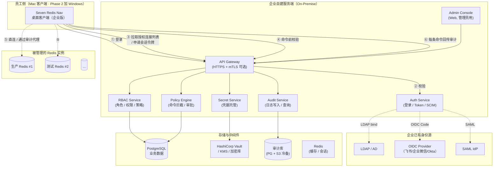
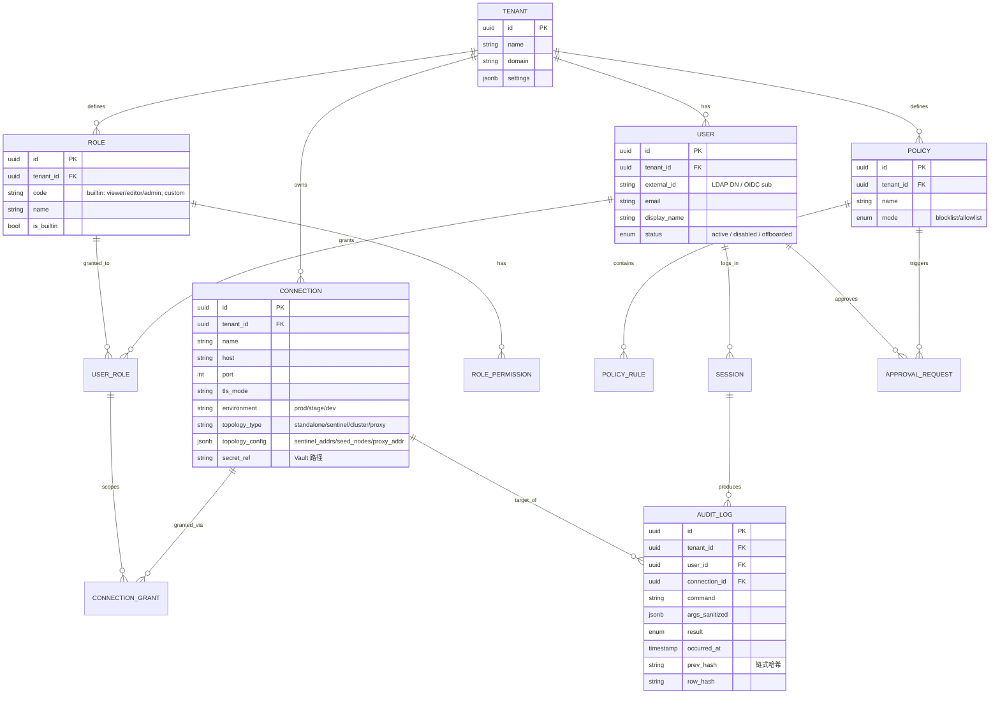
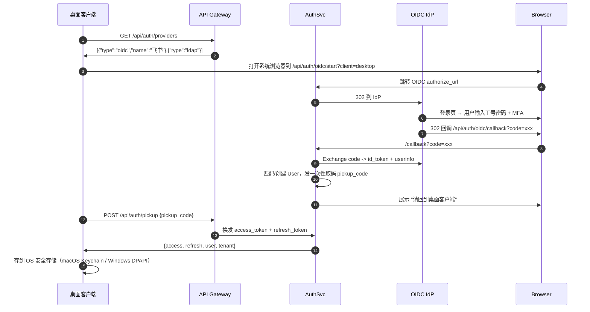
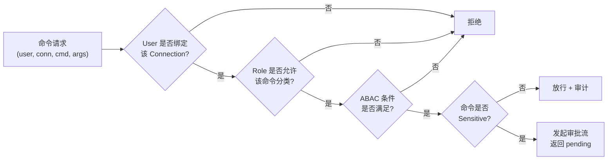
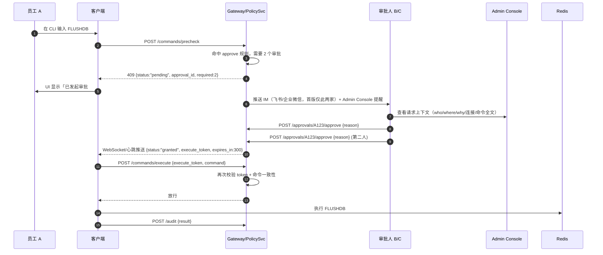
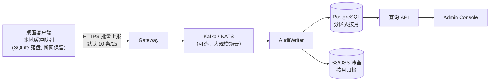
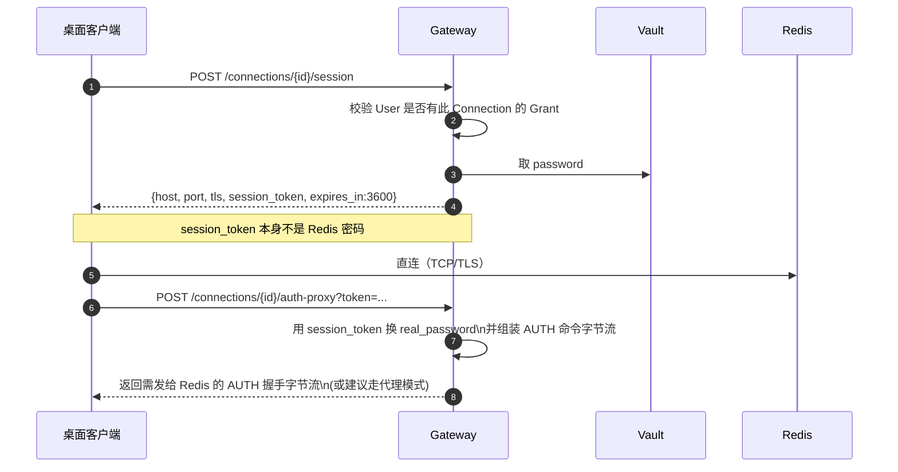
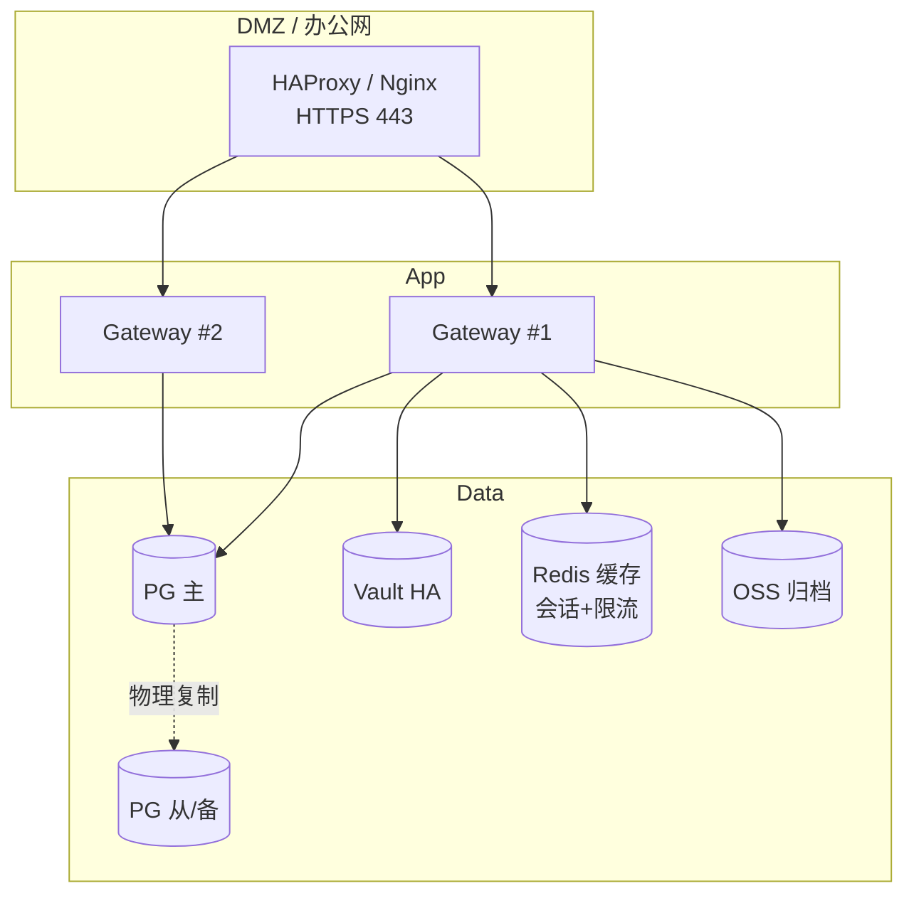

# Seven Redis Nav · 企业版（Enterprise Edition）设计方案

> 版本：v1.0 Draft · 2026-04-30
> 作者：Seven（小七）
> 适用范围：在现有 macOS 桌面个人版（Tauri 2 + Vue 3 + Rust）基础上，扩展出面向企业的「团队协作 / 统一账号 / 权限分级 / 命令审计」能力

---

## 0. 文档导航

| 章节 | 内容 |
|------|------|
| [1](#1-背景与目标) | 背景、目标、非目标 |
| [2](#2-产品形态与总体架构) | 产品形态、部署形态、总体架构图 |
| [3](#3-核心领域模型) | 租户 / 用户 / 角色 / 权限 / 连接 / 审计 领域模型 |
| [4](#4-认证子系统auth) | 登录方式：账号密码 / LDAP / OIDC / SAML / SCIM |
| [5](#5-授权子系统rbac--abac) | RBAC 角色、权限矩阵、资源范围、ABAC 条件 |
| [6](#6-敏感命令拦截与执行策略) | 命令分级、黑白名单、双人审批、只读模式 |
| [7](#7-审计日志子系统) | 日志模型、落盘链路、防篡改、查询与导出 |
| [8](#8-连接凭据托管与会话代理) | 凭据集中托管、会话代理、动态密码 |
| [9](#9-api-与前端改造) | 服务端 API、桌面端改造点、IPC 契约 |
| [10](#10-数据存储设计) | PostgreSQL Schema + 关键索引 + 数据流转 |
| [11](#11-部署与运维) | 部署拓扑、HA、备份、升级、监控 |
| [12](#12-安全威胁模型) | 威胁清单、缓解措施、合规项对照 |
| [13](#13-实施路线图) | 分阶段里程碑与交付物 |
| [14](#14-风险与开放问题) | 当前未决策点 |

---

## 1. 背景与目标

### 1.1 现状（个人版 / Community Edition）

- **形态**：macOS 原生单机桌面应用（Tauri 2 打包的 `.app` / `.dmg`）
- **数据**：全部本地存储——`SQLite` 存连接元数据、`macOS Keychain` 存密码
- **特征**：单用户、无账号体系、无权限、无审计；所有危险命令（`FLUSHDB / FLUSHALL / SHUTDOWN / DEBUG / CONFIG SET requirepass`）仅靠二次确认弹窗拦截
- **关键代码位置**：
  - CLI 执行与危险命令判定：[services/terminal.rs](../src-tauri/src/services/terminal.rs)（`is_dangerous`、`cli_exec`）
  - 连接管理：[services/connection_manager.rs](../src-tauri/src/services/connection_manager.rs)
  - 本地 schema：[migrations/001_init.sql](../src-tauri/migrations/001_init.sql)

### 1.2 企业场景痛点

1. **账号分散**：每位员工本地自己录一份连接，密码散落在个人 Mac 的 Keychain，离职无法回收
2. **权限无差别**：实习生和 DBA 看到同一份连接、能执行同样的命令
3. **审计缺失**：出了故障无从追溯"是谁在哪台机上执行了 `FLUSHALL`"
4. **敏感操作失控**：`FLUSHDB` 弹窗点"确认"即可执行，无双人复核
5. **配置共享靠 JSON 导出**：脱敏后仍需口口相传密码，违反企业安全基线

### 1.3 目标（In Scope）

- **E-1 企业账号体系**：对接企业 IdP（LDAP / OIDC / SAML），员工用工号 + 企业密码登录
- **E-2 细粒度权限**：至少支持「只读 / 读写 / 管理员」三档，且可按连接、按 Key 前缀、按命令类别约束
- **E-3 敏感命令管控**：命令三级分类（Safe / Sensitive / Forbidden），支持黑白名单、审批流
- **E-4 全量审计**：任何对 Redis 的写操作、读敏感 Key、登录行为，均落审计日志并防篡改
- **E-5 凭据托管**：Redis 密码在服务端统一保管，员工端永远拿不到真实密码
- **E-6 集中分发**：管理员维护的连接即时下发所有授权员工，离职一键回收
- **E-7 合规可对齐**：满足等保 2.0 三级、ISO 27001 相关控制项、SOC 2 Type II 的审计要求

### 1.4 非目标（Out of Scope，首版不做）

- 不替换个人版（两版共存，企业版是独立发行通道）
- 不提供 Web 版 UI（仍以桌面端为交互入口）
- 不做 Redis Proxy 数据层代理（命令仍由桌面端直连或通过隧道发送，仅在"可选的会话代理"章节探讨）
- 不做跨云的 Redis 多租管控平台

---

## 2. 产品形态与总体架构

### 2.1 双版本策略

| 维度 | 个人版 (Community) | 企业版 (Enterprise) |
|------|-------------------|---------------------|
| 发行 | 免费 / 开源 / macOS `.dmg` | 授权 / 闭源发行 / macOS（首版）+ Windows（Phase 2） |
| 账号 | 无 | 强制企业账号登录 |
| 存储 | 本地 SQLite + Keychain | 服务端 PostgreSQL + Vault/KMS，本地仅缓存 |
| 危险命令 | 二次确认 | 三级策略 + 审批流 + 审计 |
| 审计 | 无 | 全量、防篡改、可查询、可导出 |
| 部署 | 员工自己装 | 企业自建服务端 + 员工装带企业分发签名的客户端 |

企业版桌面端是个人版的"超集"：同一份 Vue 代码库通过构建时 feature flag 打包。

### 2.2 部署形态

**单一模式：私有化部署（On-Premise Self-Hosted）**

理由：
- Redis 连接信息 + 命令流是高敏感数据，企业客户普遍要求数据不出内网
- 首版不做 SaaS 托管，规避多租户数据隔离 + 公网攻击面的复杂度（Q7 已决策：不提供 SaaS 托管）
- 小团队通过"永久买断 + 维保"License + Docker Compose 一键部署降低部署门槛
- 后续若做 SaaS 版，复用本设计的"租户"维度即可平滑迁移

### 2.3 总体架构图



### 2.4 关键设计取舍

| 决策点 | 选择 | 理由 |
|--------|------|------|
| Redis 数据流是否经服务端 | **默认不经**，客户端直连 Redis | 性能 + 延迟 + 实施成本 |
| 命令是否服务端预校验 | **是**（写类/敏感命令必须预校验拿放行票） | 防止客户端被篡改绕过 |
| 审计日志由谁上报 | 客户端执行后异步上报 + 可选透明代理旁路采集 | 默认方案足够；高合规场景启用代理做"不可绕过"采集 |
| 凭据是否下发到客户端 | **否**，客户端拿到的是短时效会话 Token，由客户端持 Token 通过 TCP 与 Redis AUTH | 见 §8 详细方案 |
| 服务端技术栈 | **Rust (axum + sqlx)**，与桌面端同语言 | 桌面端已是 Tauri + Rust，同栈可复用 Redis 协议解析、命令分类、脱敏规则等代码；axum 生态成熟，性能优异且内存占用更低；编译期安全对审计场景更有保障（Q1 已决策） |

---

## 3. 核心领域模型

### 3.1 实体关系图



### 3.2 关键概念说明

- **Tenant（租户）**：一个企业 = 一个 Tenant。私有化部署通常只有 1 个 Tenant，预留多租户是为了未来 SaaS 化
- **User**：仅存"身份标识"，不存密码（密码在 IdP）。本地密码登录模式下才有 `password_hash` 字段
- **Role**：内置 3 个 + 支持自定义
  - `viewer`：只读（只能 `GET/HGET/LRANGE/SCAN/INFO/SLOWLOG` 等白名单只读命令）
  - `editor`：读写（追加 `SET/HSET/DEL/EXPIRE` 等，但禁止 DDL/运维类）
  - `admin`：全命令 + 可修改 CONFIG + 可发起审批
- **Connection**：Redis 实例元数据。密码不在本表，仅存 `secret_ref` 指向 Vault 路径。`topology_type` 标识拓扑类型（standalone / sentinel / cluster / proxy），`topology_config` 存拓扑配置（如 Sentinel 地址列表、Cluster seed node、Codis 代理地址）。路由能力下沉到服务端，桌面端始终只连一个入口地址（Q8 已决策）
- **ConnectionGrant**：把「某 Role 下的某 User」授权到「某 Connection」上的"三元组"，这是权限的最终落点
- **Policy**：命令策略集合，默认全局一份；管理员可为特定环境/连接覆盖
- **AuditLog**：不可变、链式哈希、追加写

---

## 4. 认证子系统（Auth）

### 4.1 支持的登录方式（按优先级）

| # | 方式 | 目标人群 | 首版是否必做 |
|---|------|---------|-------------|
| 1 | **OIDC**（飞书 / 企业微信 / Okta / Authing） | 大多数国内+国外企业 | ✅ 必做 |
| 2 | **LDAP / Active Directory** | 传统金融 / 制造业 | ✅ 必做 |
| 3 | **账号密码**（本地库） | 无 IdP 的小团队 / 应急备用 | ✅ 必做 |
| 4 | **SAML 2.0** | 大型外企 | ⏳ Phase 2 |
| 5 | **SCIM 2.0 自动同步** | 有 HR 系统自动 provisioning 的企业 | ⏳ Phase 2 |

> **IM 推送说明**：审批 IM 推送首版仅支持**飞书 + 企业微信**（通过机器人 Webhook + 卡片交互式审批实现）；钉钉 + Slack 列入 Phase 2（Q4 已决策）。

### 4.2 登录流程（以 OIDC 为例）



**要点**：
- 使用 **PKCE** 防客户端伪造
- Pickup Code 一次性、30 秒过期
- Access Token JWT + 短时效（15 分钟），Refresh Token 不透明（可吊销），存 Redis
- **Token 永不落裸文件**：桌面端只放 OS 级安全存储

### 4.3 Token 与会话

- Access Token Claims：`sub, tenant_id, roles[], scopes[], device_id, exp, iat, jti`
- 单用户最多 N 台设备（默认 3），管理员可在 Admin Console 强制下线任意设备
- 吊销：维护 `token_blocklist`（只存 jti + exp），Gateway 每次请求校验

### 4.4 账号生命周期

- **入职**：SCIM 自动 provisioning，或管理员在 Admin Console 手动创建并分配 Role
- **转岗**：管理员变更 Role → 客户端下次心跳拉取最新授权
- **离职**：IdP 关闭账号 → 下次请求 Gateway 时验证失败 → 客户端强制登出；同时后端主动吊销所有 Session

---

## 5. 授权子系统（RBAC + ABAC）

### 5.1 权限模型：RBAC 为主 + ABAC 为辅

**RBAC**：`User -- UserRole --> Role -- RolePermission --> Permission`

**ABAC** 补充约束：`Permission + Condition`，条件可绑定在 `UserRole` 或 `ConnectionGrant` 上。

### 5.2 内置角色与权限矩阵

| 权限点 | viewer | editor | admin |
|--------|:------:|:------:|:-----:|
| 查看连接列表 | ✅ | ✅ | ✅ |
| 测试连接 | ✅ | ✅ | ✅ |
| 浏览 Key / 扫描 | ✅ | ✅ | ✅ |
| 查看 Key 值 | ✅ | ✅ | ✅ |
| 订阅 Pub/Sub | ✅ | ✅ | ✅ |
| 查看慢日志 / INFO | ✅ | ✅ | ✅ |
| 执行只读命令（GET/HGET/LRANGE...） | ✅ | ✅ | ✅ |
| 执行写命令（SET/HSET/DEL/EXPIRE...） | ❌ | ✅ | ✅ |
| 执行 MONITOR | ❌ | ⚠️ 需审批 | ✅ |
| CONFIG SET（非 requirepass） | ❌ | ❌ | ✅ |
| CONFIG SET requirepass | ❌ | ❌ | ⚠️ 需双人审批 |
| FLUSHDB / FLUSHALL | ❌ | ❌ | ⚠️ 需双人审批 |
| SHUTDOWN / DEBUG | ❌ | ❌ | ❌（只能在 Admin Console 发工单） |
| 导入 / 导出连接配置 | ❌ | ❌ | ✅ |
| 查看审计日志（仅自己） | ✅ | ✅ | ✅ |
| 查看全员审计日志 | ❌ | ❌ | ✅ |

### 5.3 资源粒度

一条 `ConnectionGrant` 可附带以下 ABAC 条件：

```jsonc
{
  "connection_id": "uuid-prod-01",
  "role": "editor",
  "conditions": {
    "key_prefix_allow": ["user:*", "cache:*"],
    "key_prefix_deny": ["session:admin:*"],
    "command_extra_deny": ["KEYS", "MONITOR"],
    "time_window": { "cron": "MON-FRI 09:00-20:00 Asia/Shanghai" },
    "source_ip_allow": ["10.0.0.0/8"]
  }
}
```

### 5.4 鉴权决策流程



---

## 6. 敏感命令拦截与执行策略

### 6.1 命令三级分类

| 等级 | 描述 | 行为 | 举例 |
|------|------|------|------|
| **Safe** | 只读、不改变状态 | 直接放行 + 审计摘要 | `GET / HGET / LRANGE / INFO / TYPE / EXISTS` |
| **Sensitive** | 写 / 有破坏性但业务必需 | 预校验 + 审计全量 + 可配置审批 | `SET / DEL / EXPIRE / HSET / LPUSH / RENAME / CONFIG GET` |
| **Forbidden** | 可瞬间摧毁数据或破坏服务 | 默认禁用；启用需双人审批；或完全只能从 Admin Console 走工单 | `FLUSHDB / FLUSHALL / SHUTDOWN / DEBUG / SCRIPT FLUSH / CLUSTER RESET / CONFIG SET requirepass / KEYS *` |

> 个人版已实现的 `is_dangerous` 粗粒度逻辑（参见 [services/terminal.rs](../src-tauri/src/services/terminal.rs)）升级为三级策略引擎。

### 6.2 策略引擎（PolicyEngine）

**策略配置示例**（PostgreSQL 中的 `policies` 表一条记录）：

```jsonc
{
  "name": "default-production",
  "mode": "blocklist",
  "rules": [
    { "pattern": "FLUSHDB|FLUSHALL",            "action": "approve", "approvers": 2, "ttl_minutes": 10 },
    { "pattern": "SHUTDOWN|DEBUG.*",            "action": "deny" },
    { "pattern": "CONFIG SET requirepass.*",    "action": "approve", "approvers": 2 },
    { "pattern": "CONFIG SET .*",               "action": "approve", "approvers": 1 },
    { "pattern": "KEYS .*",                     "action": "warn" },
    { "pattern": "MONITOR",                     "action": "approve", "approvers": 1, "max_duration_seconds": 60 }
  ],
  "env_overrides": {
    "dev": { "rules_override": [{ "pattern": "FLUSHDB", "action": "allow" }] }
  }
}
```

**action 语义**：
- `allow`：直接放行
- `warn`：放行但前端弹黄色二次确认 + 审计标红
- `approve`：挂起，等审批（approvers 表示需要几位 admin 审批）
- `deny`：硬拒绝，连管理员都不行；仅可通过 Admin Console 的"紧急工单"走流程

### 6.3 审批流（Approval Flow）



**强约束**：
- 申请人必须写"执行理由"，≥ 20 字符
- 审批人不能是申请人自己
- `execute_token` 与原始命令**文本绑定**（签名），换一个字都作废
- 审批通过后 5 分钟内必须执行，逾期作废
- 任一审批人拒绝即全流程终止

### 6.4 只读模式（Read-Only Mode）

管理员可对任意 Connection 打上 `readonly_locked=true` 标记（如生产 Redis 日常巡检期间）：
- 所有 Sensitive / Forbidden 命令硬拒绝
- 只允许 Safe 命令
- 所有人（包括 admin）一视同仁
- 解锁需要在 Admin Console 走二次确认

---

## 7. 审计日志子系统

### 7.1 日志分类

| 类别 | 举例 | 保留期（默认） |
|------|------|----------------|
| **认证事件** | 登录成功/失败、登出、Token 刷新、异地登录告警 | 1 年 |
| **授权变更** | 角色变更、连接授权、策略变更 | 永久 |
| **命令执行** | 所有发到 Redis 的命令 + 结果摘要 | 1 年（热）+ 7 年（冷） |
| **敏感读** | 读取被打标 `sensitive=true` 的 Key（如 `user:*:password`） | 1 年 |
| **审批流** | 申请 / 审批 / 驳回 / 逾期 | 永久 |
| **系统事件** | 服务启停、配置变更 | 1 年 |

### 7.2 命令审计记录字段

```typescript
interface CommandAuditLog {
  id: string              // UUID
  tenant_id: string
  user_id: string
  user_display: string    // 冗余，便于查询
  device_id: string       // 桌面端设备指纹
  source_ip: string       // 客户端真实 IP（Gateway 取）
  session_id: string

  connection_id: string
  connection_name: string // 冗余
  environment: string     // prod / stage / dev

  command_raw: string     // 原始命令（密码类参数会被掩码）
  command_name: string    // "SET"
  command_args: string[]  // 脱敏后
  key_touched: string[]   // 涉及的 Key 列表（便于按 Key 查）

  classification: 'safe' | 'sensitive' | 'forbidden'
  policy_decision: 'allowed' | 'warned' | 'approved' | 'denied'
  approval_id?: string    // 如果走了审批

  result: 'success' | 'error' | 'timeout'
  result_size_bytes?: number
  error_message?: string
  duration_ms: number

  occurred_at: string     // RFC3339 UTC
  recorded_at: string     // 服务端落盘时间

  // 防篡改链
  prev_hash: string
  row_hash: string
}
```

### 7.3 脱敏规则

- `AUTH <password>` → `AUTH ***`
- `CONFIG SET requirepass <x>` → `CONFIG SET requirepass ***`
- 值大于 1KB 的 `SET` 参数 → 记录前 256B + `...(+N bytes)`
- 被标记为 sensitive 的 Key 的 Value → 仅记录长度与哈希，不记录明文

### 7.4 防篡改（Tamper-Evident）

- 每条日志计算 `row_hash = SHA256(prev_hash || canonical_json(this_row))`
- Append-Only 表 + PG 触发器禁止 UPDATE/DELETE（仅 `audit_admin` 角色可维护分区，且此操作本身也落审计）
- 每小时把最后一条 `row_hash` 发到 **外部不可写**渠道（如公司 OSS 的 WORM Bucket / 可选接 TSA 时间戳服务）
- 管理员侧提供"完整性校验"按钮，对任意时间段重算哈希链

### 7.5 日志落盘链路



**关键保障**：
- 客户端本地队列 + 断网缓存（SQLite 表 `pending_audit`），联网后重放
- 上报失败 5 次阻断执行（可配置）——"审计不通，业务不通"
- 服务端接收后双写（PG + 对象存储），PG 用于近期查询，对象存储用于归档和跨机房备份

### 7.6 查询与导出

管理员在 Admin Console 支持：
- 按用户 / 连接 / 环境 / 命令 / Key / 时间段 过滤
- 按分类（sensitive/forbidden）筛选
- 导出 CSV / JSONL（自带完整性哈希）
- 订阅告警规则（如"生产环境 FLUSHDB 立即推送 PagerDuty"）

---

## 8. 连接凭据托管与会话代理

### 8.1 凭据托管（Secret Custody）

管理员在 Admin Console 创建连接时录入密码，**凭据立即写入 Vault/KMS，本地 PG 只存引用路径**。

```
secret_ref = "kv/tenants/{tenant_id}/connections/{conn_id}/password"
```

桌面端全程拿不到密码原文。

### 8.2 会话票据（Session Ticket）模式



**两种实现方案选择**：

| 方案 | 描述 | 优点 | 缺点 | 推荐 |
|------|------|------|------|------|
| **A. 一次性密码下发** | 客户端通过 session_token 向 Gateway 换取「仅本次 TCP 连接使用」的密码（Redis 6 ACL 临时账号 + 短 TTL） | 对现有 Redis 侵入小 | 需要 Redis 6 ACL；需要定时清理临时账号 | ⭐⭐⭐ 首版 |
| **B. 前置代理（Proxy）** | 所有命令经 Gateway 旁的 TCP Proxy 转发，Proxy 持真密码 | 100% 审计不可绕过；密码永不离开服务端 | 增加延迟；Proxy 需水平扩展；实现复杂 | Phase 2 可选 |

**方案 A 细节**：
- **Redis 6+**（首选）：使用 `ACL SETUSER tmp_<nonce> on ~* &* -@dangerous >pwd ...` 动态创建账号；账号 TTL 由后台清理任务 + `CLIENT KILL` 保障
- **Redis 4.x-5.x**（降级一）：共享密码 + **强制走 Proxy 代理模式**。所有命令经 Gateway 旁的 TCP Proxy 转发，Proxy 层做命令级拦截 + 审计，客户端拿不到真实密码
- **Redis < 4 或无密码**（降级二）：纯 Proxy 模式 + 服务端注入 `rename-command` 映射（如把 `FLUSHDB` 映射为不可达的随机字符串），配合 Proxy 层拦截实现安全管控
- Admin Console 创建连接时自动检测 Redis 版本（`INFO server`），并提示推荐模式
- 不硬性要求客户升级 Redis（Q3 已决策）

### 8.3 离职回收

员工 Session 吊销后：
- 新命令请求直接拒绝
- 主动扫描在用的动态账号并 `ACL DELUSER`
- 踢掉所有该账号的活跃 TCP 连接（`CLIENT KILL`）

---

## 9. API 与前端改造

### 9.1 服务端 HTTP API（节选）

```
# 认证
POST   /api/v1/auth/providers              列出支持的登录方式
GET    /api/v1/auth/oidc/start             发起 OIDC
GET    /api/v1/auth/oidc/callback          OIDC 回调
POST   /api/v1/auth/pickup                 桌面端换 Token
POST   /api/v1/auth/refresh                刷新 Token
POST   /api/v1/auth/logout

# 当前用户 & 授权
GET    /api/v1/me                          用户信息 + 角色 + 授权连接列表
GET    /api/v1/me/connections              可访问的 Redis 连接（脱敏）

# 会话
POST   /api/v1/connections/:id/session     申请连接会话（返回 host/port/token）
DELETE /api/v1/connections/:id/session/:sid

# 命令策略
POST   /api/v1/commands/precheck           命令预检（返回 allow/warn/approve/deny）
POST   /api/v1/commands/execute            附 execute_token 的执行凭证
POST   /api/v1/audit/commands              批量上报审计

# 审批
POST   /api/v1/approvals                   发起
GET    /api/v1/approvals/:id
POST   /api/v1/approvals/:id/approve
POST   /api/v1/approvals/:id/reject

# Admin
GET/POST/PUT/DELETE /api/v1/admin/users
GET/POST/PUT/DELETE /api/v1/admin/connections
GET/POST/PUT/DELETE /api/v1/admin/roles
GET/POST/PUT/DELETE /api/v1/admin/policies
GET                 /api/v1/admin/audit
```

### 9.2 桌面端改造点（对照现有代码）

| 改造点 | 涉及文件 | 说明 |
|--------|---------|------|
| 启动时增加登录门面 | `src/views/` 新增 `EnterpriseLoginView.vue` + 路由守卫 | 未登录直接挡到登录页 |
| 连接列表改由服务端下发 | `src/stores/` 新 `enterpriseConnections.ts`；隐藏"新建连接"入口 | 企业版普通员工不能自建连接 |
| Tauri IPC 命令增加上下文 | [commands/connection.rs](../src-tauri/src/commands/connection.rs) 所有命令参数新增 `auth_ctx` | 把 Access Token 透传到后续 HTTP 调用 |
| CLI 执行前插策略检查 | [services/terminal.rs](../src-tauri/src/services/terminal.rs) `cli_exec` 改造 | 本地 `is_dangerous` 改为"调用服务端 `/commands/precheck`" |
| 本地审计缓冲队列 | 新模块 `src-tauri/src/services/audit_queue.rs` + migration 003 | 断网可用 |
| 密码不走 Keychain | [utils/keychain.rs](../src-tauri/src/utils/keychain.rs) 在企业版模式下改为"只存 refresh_token" | |
| 构建时 Feature Flag | `Cargo.toml` 新增 `enterprise` feature；`package.json` 新脚本 `tauri:build:enterprise` | 同一代码库产出两个包 |
| Admin Console Web 端 | `admin-console/` 子目录（Vue 3 + TDesign，复用样式，同仓不独立） | 给管理员用 |

### 9.3 IPC 契约变更示例

```rust
// 企业版下新增
#[tauri::command]
async fn cli_exec_enterprise(
    connection_id: String,
    raw_command: String,
    approval_token: Option<String>, // 走过审批的 execute_token
    auth_ctx: AuthContext,          // 从前端透传的 Access Token
) -> IpcResult<CliReply> { ... }
```

---

## 10. 数据存储设计

### 10.1 服务端 PostgreSQL Schema（节选）

```sql
-- 租户
CREATE TABLE tenants (
  id          UUID PRIMARY KEY DEFAULT gen_random_uuid(),
  name        TEXT NOT NULL,
  domain      TEXT UNIQUE NOT NULL,
  settings    JSONB NOT NULL DEFAULT '{}'::jsonb,
  created_at  TIMESTAMPTZ NOT NULL DEFAULT now()
);

-- 用户
CREATE TABLE users (
  id           UUID PRIMARY KEY DEFAULT gen_random_uuid(),
  tenant_id    UUID NOT NULL REFERENCES tenants(id),
  external_id  TEXT,                       -- OIDC sub / LDAP DN
  email        TEXT NOT NULL,
  display_name TEXT NOT NULL,
  password_hash TEXT,                      -- 仅本地账号密码模式
  status       TEXT NOT NULL DEFAULT 'active',
  created_at   TIMESTAMPTZ NOT NULL DEFAULT now(),
  UNIQUE(tenant_id, email)
);

-- 角色
CREATE TABLE roles (
  id         UUID PRIMARY KEY DEFAULT gen_random_uuid(),
  tenant_id  UUID NOT NULL REFERENCES tenants(id),
  code       TEXT NOT NULL,
  name       TEXT NOT NULL,
  is_builtin BOOLEAN NOT NULL DEFAULT false,
  UNIQUE(tenant_id, code)
);

-- 用户-角色
CREATE TABLE user_roles (
  user_id UUID NOT NULL REFERENCES users(id),
  role_id UUID NOT NULL REFERENCES roles(id),
  PRIMARY KEY (user_id, role_id)
);

-- 连接（不含密码，密码在 Vault）
CREATE TABLE connections (
  id          UUID PRIMARY KEY DEFAULT gen_random_uuid(),
  tenant_id   UUID NOT NULL REFERENCES tenants(id),
  name        TEXT NOT NULL,
  host        TEXT NOT NULL,
  port        INT NOT NULL DEFAULT 6379,
  tls_mode    TEXT NOT NULL DEFAULT 'none',
  environment TEXT NOT NULL DEFAULT 'dev',
  topology_type TEXT NOT NULL DEFAULT 'standalone',  -- standalone/sentinel/cluster/proxy
  topology_config JSONB NOT NULL DEFAULT '{}'::jsonb, -- sentinel_addrs/seed_nodes/proxy_addr 等
  secret_ref  TEXT NOT NULL,
  readonly_locked BOOLEAN NOT NULL DEFAULT false,
  created_at  TIMESTAMPTZ NOT NULL DEFAULT now()
);

-- 连接授权（三元组 + ABAC conditions）
CREATE TABLE connection_grants (
  id            UUID PRIMARY KEY DEFAULT gen_random_uuid(),
  user_id       UUID NOT NULL REFERENCES users(id),
  connection_id UUID NOT NULL REFERENCES connections(id),
  role_id       UUID NOT NULL REFERENCES roles(id),
  conditions    JSONB NOT NULL DEFAULT '{}'::jsonb,
  created_at    TIMESTAMPTZ NOT NULL DEFAULT now(),
  UNIQUE(user_id, connection_id)
);

-- 策略
CREATE TABLE policies (
  id         UUID PRIMARY KEY DEFAULT gen_random_uuid(),
  tenant_id  UUID NOT NULL REFERENCES tenants(id),
  name       TEXT NOT NULL,
  mode       TEXT NOT NULL DEFAULT 'blocklist',
  rules      JSONB NOT NULL,
  attached_environments TEXT[] NOT NULL DEFAULT '{}'
);

-- 审批
CREATE TABLE approval_requests (
  id            UUID PRIMARY KEY DEFAULT gen_random_uuid(),
  tenant_id     UUID NOT NULL,
  requester_id  UUID NOT NULL REFERENCES users(id),
  connection_id UUID NOT NULL REFERENCES connections(id),
  command_text  TEXT NOT NULL,
  command_hash  TEXT NOT NULL,
  reason        TEXT NOT NULL,
  required_approvers INT NOT NULL,
  status        TEXT NOT NULL DEFAULT 'pending',
  execute_token TEXT,
  created_at    TIMESTAMPTZ NOT NULL DEFAULT now(),
  expires_at    TIMESTAMPTZ NOT NULL
);

CREATE TABLE approval_decisions (
  id           UUID PRIMARY KEY DEFAULT gen_random_uuid(),
  approval_id  UUID NOT NULL REFERENCES approval_requests(id),
  approver_id  UUID NOT NULL REFERENCES users(id),
  decision     TEXT NOT NULL,
  reason       TEXT,
  decided_at   TIMESTAMPTZ NOT NULL DEFAULT now()
);

-- 审计日志（按月分区）
CREATE TABLE audit_logs (
  id            UUID NOT NULL,
  tenant_id     UUID NOT NULL,
  user_id       UUID,
  connection_id UUID,
  category      TEXT NOT NULL,        -- auth/rbac/command/system
  command_name  TEXT,
  command_raw   TEXT,
  command_args  JSONB,
  classification TEXT,                 -- safe/sensitive/forbidden
  policy_decision TEXT,
  approval_id   UUID,
  result        TEXT,
  duration_ms   INT,
  occurred_at   TIMESTAMPTZ NOT NULL,
  recorded_at   TIMESTAMPTZ NOT NULL DEFAULT now(),
  source_ip     INET,
  device_id     TEXT,
  prev_hash     TEXT,
  row_hash      TEXT NOT NULL,
  PRIMARY KEY (occurred_at, id)
) PARTITION BY RANGE (occurred_at);

-- 关键索引
CREATE INDEX idx_audit_user_time ON audit_logs (tenant_id, user_id, occurred_at DESC);
CREATE INDEX idx_audit_conn_time ON audit_logs (tenant_id, connection_id, occurred_at DESC);
CREATE INDEX idx_audit_classification ON audit_logs (tenant_id, classification, occurred_at DESC)
  WHERE classification IN ('sensitive','forbidden');
```

### 10.2 桌面端本地库扩展（migration 003）

```sql
-- 企业版本地缓冲队列
CREATE TABLE IF NOT EXISTS pending_audit (
  id         INTEGER PRIMARY KEY AUTOINCREMENT,
  payload    TEXT NOT NULL,
  retries    INTEGER NOT NULL DEFAULT 0,
  created_at TEXT NOT NULL
);

-- 企业模式下的账户凭据（仅 refresh_token 密文）
CREATE TABLE IF NOT EXISTS enterprise_session (
  id            INTEGER PRIMARY KEY CHECK (id = 1),
  server_url    TEXT NOT NULL,
  user_id       TEXT NOT NULL,
  keychain_key  TEXT NOT NULL,  -- refresh_token 存 Keychain
  updated_at    TEXT NOT NULL
);
```

---

## 11. 部署与运维

### 11.1 拓扑



### 11.2 部署方式

- **推荐**：Docker Compose（单机试点） + Kubernetes Helm Chart（生产）
- 发行物：
  - `redis-nav-enterprise-server` Docker 镜像（含 Gateway + 所有 Service，编译为单一 Rust 二进制 + 子命令切换角色，简化部署）
  - `redis-nav-enterprise-admin-console` Docker 镜像
  - `redis-nav.dmg` 桌面客户端（企业版，带代码签名；Phase 2 增加 `redis-nav.msi` Windows 版）

### 11.3 备份与恢复

- PG：每日全量 + WAL 持续归档
- Vault：厂商内置的 Snapshot（每 6 小时）
- 审计归档：S3/OSS 多版本 + WORM
- RPO ≤ 15 分钟，RTO ≤ 2 小时

### 11.4 监控

| 维度 | 指标 |
|------|------|
| 业务 | 登录成功率、审批平均时长、被拒命令数、FLUSH 类命令发起数 |
| 性能 | `/commands/precheck` p99 延迟、PG 慢查询、Vault 延迟 |
| 安全 | 异地登录、短时大量失败登录、审计哈希链校验失败 |

---

## 12. 安全威胁模型

| 威胁 | 缓解措施 |
|------|---------|
| 客户端被篡改绕过 precheck | Sensitive/Forbidden 命令服务端强制二次校验；可选启用 Proxy 模式 |
| 员工导出连接配置泄露 | 企业版关闭"导出连接 JSON"功能；密码不可导出 |
| Access Token 窃取 | 15 分钟短时效 + 设备指纹绑定 + 异常 IP 触发重认证 |
| 审计日志伪造/删除 | 链式哈希 + Append-Only + 外部 WORM 存档 + 周期性完整性校验 |
| 离职员工仍能登录 | IdP 同步状态 + Admin Console 一键吊销 + 动态 Redis 账号清理 |
| 管理员自己作恶 | Admin 的所有操作同样入审计；关键配置变更（如关闭审计）需要双人审批；可选"四眼原则"总开关 |
| 内网 Gateway 被直接攻击 | mTLS + 允许的 IP 段限定 + WAF + 限流 |
| Vault 被拖库 | Vault 本身加密 + 审计；密钥 Seal/Unseal 由分片持有 |

### 合规对照（简表）

| 控制项 | 等保 2.0 三级 | ISO 27001 | SOC 2 |
|--------|:---:|:---:|:---:|
| 身份鉴别（唯一性/口令强度/MFA） | 8.1.3 | A.9.2 | CC6.1 |
| 访问控制 | 8.1.4 | A.9.1 | CC6.2 |
| 安全审计（不可删改） | 8.1.5 | A.12.4 | CC7.2 |
| 剩余信息保护（密码托管） | 8.1.7 | A.10.1 | CC6.7 |
| 入侵防范（异常检测） | 8.1.10 | A.12.6 | CC7.3 |

---

## 13. 实施路线图

### 13.1 里程碑

| 阶段 | 周期 | 交付 | 验收标准 |
|------|-----|------|---------|
| **M0 · 架构验证（Spike）** | 2 周 | Rust (axum + sqlx) Gateway 骨架 + PG + Vault + 桌面端 Enterprise Mode Flag 打通登录 | 一个工号能 OIDC 登录并看到一条 mock 连接 |
| **M1 · 最小闭环 MVP** | 6 周 | OIDC + LDAP + 账密登录；RBAC 3 内置角色；Connection CRUD；CLI 预检；基础审计；Admin Console v0 | 管理员建连接 → 授权给员工 → 员工登录 → 跑 GET/SET → 审计可查 |
| **M2 · 策略与审批** | 4 周 | 命令三级分类 + 策略引擎 + 审批流 + 飞书/企微 IM 推送 + 只读模式 | FLUSHDB 能走 2 人审批；生产环境锁定态一切写操作被拒；审批推送飞书/企微可交互审批 |
| **M3 · 审计增强** | 3 周 | 链式哈希 + 完整性校验 + OSS 归档 + 查询/导出 + 告警订阅 | 任意时间段审计可导出 + 哈希链校验通过 |
| **M4 · 凭据托管** | 3 周 | Vault 对接 + 动态 Redis 账号 + 离职回收 + session ticket | 员工全程看不到 Redis 密码；Admin Console 一键吊销 |
| **M5 · 打磨与合规** | 4 周 | SAML + SCIM + Windows 客户端 + 钉钉/Slack IM 推送 + License 计费模块 + 监控大盘 + Helm Chart + 代码签名 + 安全渗透测试报告 | 通过第三方渗透测试；可拿出合规证据包；Windows 客户端可用；License 按席位年费计费可运行 |
| **M6 · GA** | 2 周 | 正式版本发布 + 部署文档 + 运维手册 + 培训材料 | 首个付费客户上线 |

总计 **≈ 24 周**（6 人研发团队估算）。

### 13.2 OpenSpec Change 拆分建议

遵循本仓库已有的 OpenSpec 工作流（`openspec/changes/`），建议按下列 Change 切分，便于增量评审与实施：

1. `add-enterprise-mode-flag` — 构建时 feature flag + 启动时判定
2. `add-enterprise-auth-oidc-ldap` — M1 的认证
3. `add-enterprise-rbac` — M1 的 RBAC
4. `add-enterprise-connection-broker` — M1 的连接下发
5. `add-enterprise-audit-pipeline` — M1 的基础审计
6. `add-enterprise-policy-engine` — M2
7. `add-enterprise-approval-flow` — M2
8. `add-enterprise-audit-integrity` — M3
9. `add-enterprise-secret-custody` — M4
10. `add-enterprise-saml-scim` — M5

---

## 14. 风险与开放问题

### 14.1 已决策（Resolved）

| # | 问题 | 决策 | 理由 | 决策时间 |
|---|------|------|------|---------|
| Q1 | 服务端语言选 Rust（axum）还是 Go（gin/echo）？ | **Rust (axum + sqlx)** | ① 桌面端已是 Tauri + Rust，同语言栈可复用 Redis 协议解析、命令分类、脱敏规则等代码；② axum 生态成熟（tokio + tower + sqlx + tracing），性能与 Go 并列但内存更小；③ 企业版服务端是长期维护的核心资产，Rust 编译期安全对"审计不可出错"场景更有保障；④ Go 的优势（快速开发、goroutine）在本场景下不足以抵消跨语言栈的维护成本 | 2026-05-01 |
| Q2 | 是否在首版就支持 Windows 客户端，还是只 macOS？ | **首版只做 macOS，Phase 2（M5）加 Windows** | ① 首版需验证核心流程（登录→授权→命令拦截→审计），不应被平台适配分散精力；② 目标客户（国内互联网/金融）Mac 占比极高，首版覆盖 Mac 即可满足 90% 场景；③ Windows 适配工作量主要在：EV 代码签名、MSI 打包、DPAPI 替代 Keychain、路径差异、UI 字体/布局，需独立排期；④ Tauri 2 天然支持 Windows 交叉编译，技术风险低，但测试与 QA 投入不可省 | 2026-05-01 |
| Q4 | 审批 IM 推送首版支持哪几家（飞书/企微/钉钉/Slack）？ | **首版支持飞书 + 企业微信；钉钉 + Slack 列入 Phase 2** | ① 飞书 + 企微覆盖国内 80%+ 企业 IM 场景，钉钉份额下滑且 API 更封闭；② 两者均支持「机器人 Webhook + 卡片交互式审批」，可一体化实现"推送→查看→审批/驳回"闭环；③ Slack 是海外场景，首版（国内客户为主）优先级低；④ 钉钉机器人 Webhook + 审批流 API 改动频繁，维护成本相对高 | 2026-05-01 |
| Q6 | License 模式：按席位年费 / 按实例 / 永久买断 + 维保？ | **按席位年费（Seat-based Subscription）为主；小团队（≤10 席）提供永久买断 + 年度维保（20%/年）可选** | ① 按席位年费是企业软件绝对主流（GitLab / JetBrains / Notion 均采用），续费收入稳定可预测；② 对小团队提供买断选项降低首次决策门槛；③ 不选"按实例"：客户可能把所有 Redis 塞进一个 Cluster，收入与价值不匹配；④ 不选纯"买断"：缺乏续费动力，无法支撑持续迭代投入 | 2026-05-01 |

### 14.2 已决策（Resolved，续）

| # | 问题 | 决策 | 理由 | 决策时间 |
|---|------|------|------|---------|
| Q3 | 动态 Redis 账号方案对非 Redis 6 的老版本如何降级？是否硬性要求客户升级？ | **不硬性要求升级；三级降级策略**：① Redis 6+ → 动态 ACL 账号（方案 A，首选）；② Redis 4.x-5.x（有 `requirepass`）→ 共享密码 + 强制走 Proxy 代理模式，Proxy 层做命令拦截+审计；③ Redis < 4 或无密码 → 纯 Proxy 模式 + 服务端注入 `rename-command` 映射。Admin Console 创建连接时自动检测 Redis 版本并提示推荐模式 | ① 金融/运营商客户生产 Redis 可能多年不升级，硬性要求不现实；② 三级降级让客户按实际版本自动选路径；③ Proxy 模式对 < 6 老版本是唯一可做到"密码不出服务端 + 审计不可绕过"的方案 | 2026-05-01 |
| Q5 | 是否在同一仓库出企业版客户端，还是独立仓库？ | **同一仓库**，通过 `enterprise` feature flag + 构建脚本区分 | ① 个人版是企业版的子集，90% 代码共享，独立仓库会产生大量重复维护；② Feature Flag 机制已在 §9.2 设计完毕（`Cargo.toml` 的 `enterprise` feature + `package.json` 构建脚本）；③ 同仓方便后续 cherry-pick 个人版的 bugfix 到企业版 | 2026-05-01 |
| Q7 | Admin Console 是否允许 SaaS 托管模式给小客户作过渡？ | **不提供 SaaS 托管** | ① Redis 连接信息 + 命令流是最高敏感数据，SaaS 模式的公网攻击面 + 多租户隔离复杂度在首版不值得投入；② §2.2 已明确"单一模式：私有化部署"；③ 小团队可通过"永久买断 + 维保"License + Docker Compose 一键部署解决部署门槛问题 | 2026-05-01 |
| Q8 | 对 Redis Cluster / Sentinel / 代理（Codis / Twemproxy）拓扑的会话路由如何处理？ | **路由能力下沉到服务端（Gateway/Proxy），桌面端始终只连一个入口地址**。四种拓扑类型：① Standalone → 直连单节点；② Sentinel → Gateway 动态查询 Sentinel 获取 master 地址，客户端只连 master；③ Cluster → Admin Console 录入 seed node 列表，Gateway 内置 Cluster 客户端做 slot 路由，桌面端无需实现 Cluster 协议；④ Codis/Twemproxy → 客户端直连代理入口地址。Connection 模型新增 `topology_type` + `topology_config` 字段 | ① 桌面端无需实现 Redis Cluster/Sentinel 协议，大幅降低客户端复杂度；② 拓扑变更只需 Admin Console 更新配置，无需重装客户端；③ 与 §8 凭据托管方案天然契合——Gateway/Proxy 持真密码，客户端只拿 session_token | 2026-05-01 |

---

## 附录 A · 与个人版代码的映射关系

| 企业能力 | 当前个人版位置 | 改造方向 |
|---------|---------------|---------|
| 登录 | 无 | 新增 `src/views/EnterpriseLoginView.vue` + `src-tauri/src/services/auth_client.rs` |
| 危险命令 | [services/terminal.rs `is_dangerous`](../src-tauri/src/services/terminal.rs) | 保留为"离线降级策略"，主路径改走服务端 precheck |
| 连接管理 | [services/connection_manager.rs](../src-tauri/src/services/connection_manager.rs) | 企业模式下禁用本地 CRUD，改为从 Gateway 拉取 |
| 本地 SQLite | [migrations/001_init.sql](../src-tauri/migrations/001_init.sql) | 追加 003 migration（pending_audit + enterprise_session） |
| 密码存储 | [utils/keychain.rs](../src-tauri/src/utils/keychain.rs) | 企业模式下只存 refresh_token |
| CLI 历史 | `cli_history` 表 | 保留本地 + 额外上报服务端（作为审计一部分） |

---

> **反馈**：本方案只做"设计" ，不含代码改动。实施前建议先与客户/内部安全团队走一轮评审，重点确认第 14 章的开放问题。
