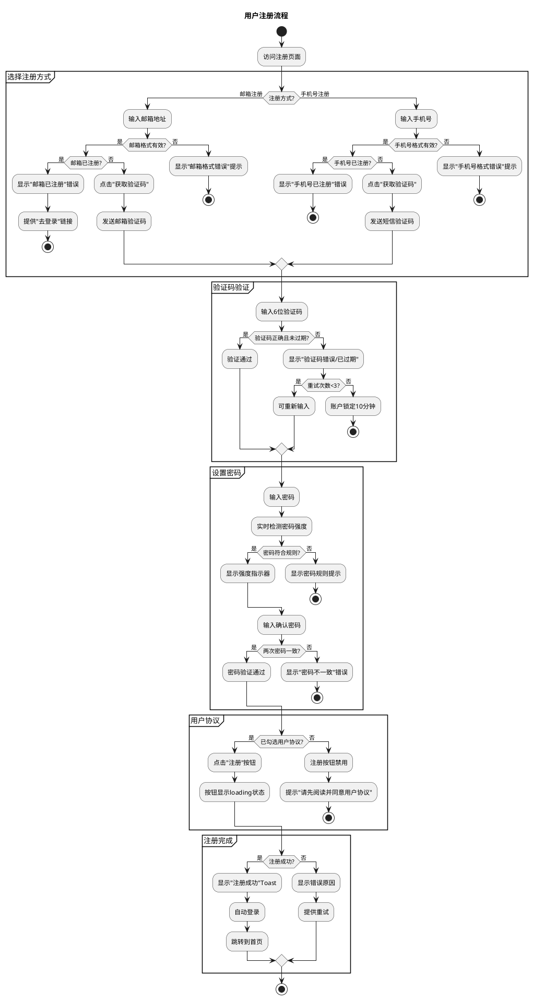
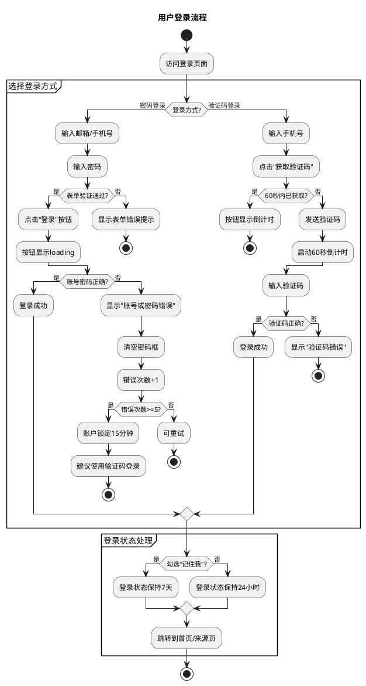
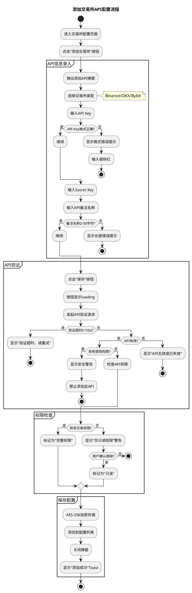
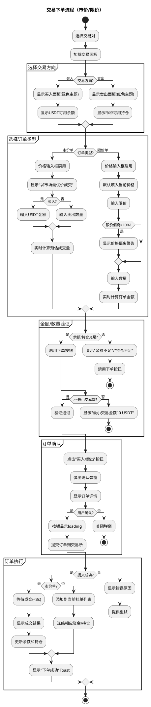
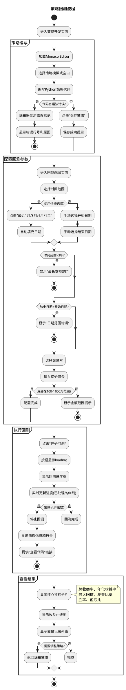
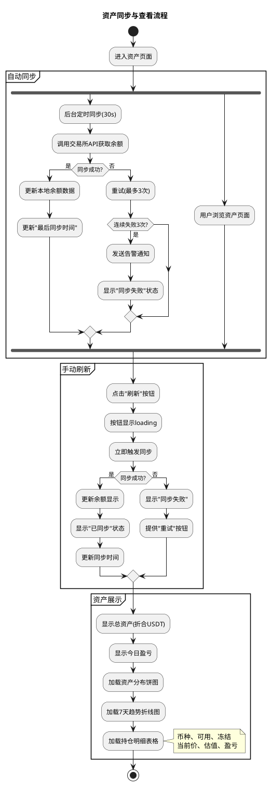
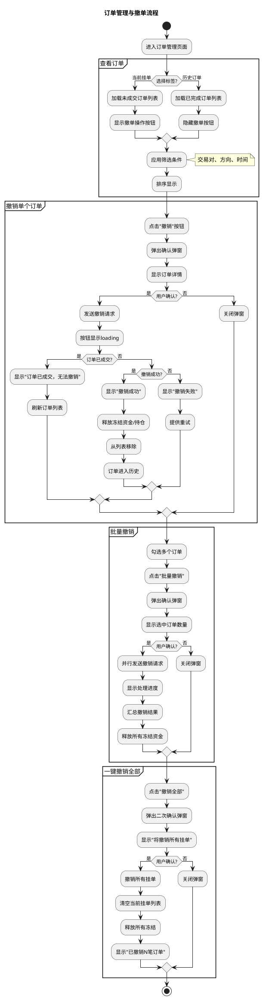

# 加密货币量化交易系统 - 交互设计文档

> **文档版本**：v1.0  
> **文档状态**：Draft  
> **创建日期**：2026-02-02  
> **编制方法**：ba-06-ui-html-prototype 任务2  
> **设计风格**：金融量化交易风格（参考 TradingView）  
> **组件库**：TDesign

---

## 第1章：PlantUML活动图代码

### 1.1 用户注册流程



### 1.2 用户登录流程



### 1.3 交易所API配置流程



### 1.4 交易下单流程



### 1.5 策略回测流程



### 1.6 资产同步与查看流程



### 1.7 订单管理与撤单流程



---

## 第2章：关键交互点说明

### 2.1 用户系统交互

| 页面 | 交互元素 | 触发动作 | 响应效果 | 目标状态/跳转 | 防抖/节流 |
|------|---------|---------|---------|-------------|----------|
| 登录页 | loginTypeTabs | 点击 | 切换登录方式Tab | 表单内容切换 | 无 |
| 登录页 | accountInput | 输入/失焦 | 实时格式校验 | 显示校验结果 | 200ms |
| 登录页 | passwordInput | 输入 | 字符输入 | 密文显示 | 无 |
| 登录页 | passwordToggle | 点击 | 切换显示/隐藏 | 明文/密文切换 | 无 |
| 登录页 | loginBtn | 点击 | 提交登录请求 | loading→成功/失败 | 300ms |
| 登录页 | rememberCheckbox | 点击 | 切换记住状态 | checked/unchecked | 无 |
| 登录页 | forgotPasswordLink | 点击 | 跳转找回密码 | 路由跳转 | 无 |
| 注册页 | registerTypeTabs | 点击 | 切换注册方式Tab | 表单内容切换 | 无 |
| 注册页 | emailInput | 输入/失焦 | 格式+唯一性校验 | 显示校验结果 | 300ms |
| 注册页 | getCodeBtn | 点击 | 发送验证码 | countdown(60s) | 无(按钮自禁用) |
| 注册页 | verifyCodeInput | 输入 | 6位自动提交校验 | 校验结果 | 无 |
| 注册页 | passwordInput | 输入 | 实时强度检测 | 更新强度指示器 | 100ms |
| 注册页 | strengthIndicator | 自动 | 根据密码计算 | weak/medium/strong | 无 |
| 注册页 | confirmPasswordInput | 输入/失焦 | 一致性校验 | 显示匹配结果 | 200ms |
| 注册页 | agreementCheckbox | 点击 | 切换同意状态 | 启用/禁用注册按钮 | 无 |
| 注册页 | registerBtn | 点击 | 提交注册请求 | loading→成功/失败 | 300ms |

### 2.2 行情服务交互

| 页面 | 交互元素 | 触发动作 | 响应效果 | 目标状态/跳转 | 防抖/节流 |
|------|---------|---------|---------|-------------|----------|
| 行情主页 | pairSearchInput | 输入 | 实时过滤交易对列表 | 筛选结果更新 | 200ms |
| 行情主页 | priceListRow | 点击 | 选中交易对 | 更新K线图+下单面板 | 无 |
| 行情主页 | priceListRow | 悬浮 | 显示行悬浮效果 | hover状态 | 无 |
| 行情主页 | priceChangeTag | 自动 | 价格变动时更新 | 闪烁动效+颜色更新 | 无(实时) |
| 行情主页 | periodButtons | 点击 | 切换K线时间周期 | 重新加载K线数据 | 无 |
| 行情主页 | chartTypeBtn | 点击 | 切换图表类型 | 蜡烛图/线图切换 | 无 |
| 行情主页 | klineChart | 滚轮 | 缩放图表 | 调整显示范围 | 100ms |
| 行情主页 | klineChart | 拖拽 | 查看历史数据 | 加载更多历史K线 | 100ms |
| 行情主页 | klineChart | 悬浮 | 显示K线详情 | tooltip显示OHLCV | 无 |
| 行情主页 | fullscreenBtn | 点击 | 切换全屏模式 | 全屏/退出全屏 | 无 |
| 行情主页 | depthChart | 悬浮 | 显示深度详情 | tooltip显示价格/累计量 | 无 |
| 行情主页 | depthRangeButtons | 点击 | 切换深度范围 | ±1%/±2%/±5%切换 | 无 |
| 行情主页 | connectionStatus | 自动 | WebSocket状态变化 | 颜色指示器更新 | 无 |

### 2.3 交易系统交互

| 页面 | 交互元素 | 触发动作 | 响应效果 | 目标状态/跳转 | 防抖/节流 |
|------|---------|---------|---------|-------------|----------|
| 行情主页 | orderSideTabs | 点击 | 切换买入/卖出 | 面板主题色切换 | 无 |
| 行情主页 | orderTypeSelect | 点击 | 选择订单类型 | 展开下拉选项 | 无 |
| 行情主页 | orderTypeSelect | 选择 | 切换市价/限价 | 价格输入框启用/禁用 | 无 |
| 行情主页 | priceInput | 输入 | 输入限价价格 | 实时计算订单金额 | 200ms |
| 行情主页 | priceInput | 失焦 | 价格校验 | 显示价格偏离警告 | 无 |
| 行情主页 | amountInput | 输入 | 输入数量/金额 | 实时计算预估结果 | 200ms |
| 行情主页 | percentButtons | 点击 | 快捷设置金额 | 自动填充25%/50%/75%/MAX | 无 |
| 行情主页 | submitOrderBtn | 点击 | 提交订单 | 弹出确认弹窗 | 300ms |
| 行情主页 | orderConfirmModal | 确认 | 确认下单 | 发送订单请求 | 无(按钮自禁用) |
| 行情主页 | orderConfirmModal | 取消 | 取消下单 | 关闭弹窗 | 无 |

### 2.4 订单管理交互

| 页面 | 交互元素 | 触发动作 | 响应效果 | 目标状态/跳转 | 防抖/节流 |
|------|---------|---------|---------|-------------|----------|
| 订单管理页 | orderListTabs | 点击 | 切换当前/历史订单 | 加载对应订单列表 | 无 |
| 订单管理页 | orderSearchInput | 输入 | 搜索订单 | 过滤订单列表 | 200ms |
| 订单管理页 | pairFilterSelect | 选择 | 按交易对筛选 | 更新筛选结果 | 无 |
| 订单管理页 | sideFilterSelect | 选择 | 按方向筛选 | 更新筛选结果 | 无 |
| 订单管理页 | cancelOrderBtn | 点击 | 撤销单个订单 | 弹出确认弹窗 | 300ms |
| 订单管理页 | orderSelectCheckbox | 点击 | 选中订单 | 更新批量操作状态 | 无 |
| 订单管理页 | batchCancelBtn | 点击 | 批量撤销 | 弹出批量确认弹窗 | 300ms |
| 订单管理页 | cancelAllBtn | 点击 | 一键撤销全部 | 弹出二次确认弹窗 | 300ms |
| 订单管理页 | cancelConfirmModal | 确认 | 确认撤销 | 执行撤销操作 | 无 |

### 2.5 资产管理交互

| 页面 | 交互元素 | 触发动作 | 响应效果 | 目标状态/跳转 | 防抖/节流 |
|------|---------|---------|---------|-------------|----------|
| 资产总览页 | syncBalanceBtn | 点击 | 手动刷新余额 | syncing→success/error | 300ms |
| 资产总览页 | assetPieChart | 悬浮 | 显示币种详情 | tooltip显示占比+金额 | 无 |
| 资产总览页 | assetPieChart | 点击扇区 | 高亮币种 | 高亮对应表格行 | 无 |
| 资产总览页 | assetTrendChart | 悬浮 | 显示日期资产 | tooltip显示日期+总资产 | 无 |
| 资产总览页 | holdingsTable | 表头点击 | 排序 | 按列排序切换 | 无 |

### 2.6 交易所配置交互

| 页面 | 交互元素 | 触发动作 | 响应效果 | 目标状态/跳转 | 防抖/节流 |
|------|---------|---------|---------|-------------|----------|
| 交易所配置页 | addExchangeBtn | 点击 | 打开添加弹窗 | 显示addExchangeModal | 无 |
| 交易所配置页 | exchangeTypeSelect | 选择 | 选择交易所类型 | 更新API格式提示 | 无 |
| 交易所配置页 | apiKeyInput | 输入/失焦 | 格式校验 | 显示校验结果 | 200ms |
| 交易所配置页 | secretKeyInput | 输入 | 密文输入 | 密文显示 | 无 |
| 交易所配置页 | secretKeyToggle | 点击 | 切换显示/隐藏 | 明文/密文切换 | 无 |
| 交易所配置页 | saveApiBtn | 点击 | 保存并验证API | loading→验证结果 | 300ms |
| 交易所配置页 | verifyApiBtn | 点击 | 验证API连接 | verifying→success/error | 300ms(10s内禁用) |
| 交易所配置页 | deleteApiBtn | 点击 | 删除API配置 | 弹出确认弹窗 | 300ms |
| 交易所配置页 | exchangeCard | 悬浮 | 显示操作按钮 | 显示验证/删除按钮 | 无 |

### 2.7 策略开发交互

| 页面 | 交互元素 | 触发动作 | 响应效果 | 目标状态/跳转 | 防抖/节流 |
|------|---------|---------|---------|-------------|----------|
| 策略开发页 | codeEditor | 输入 | 代码编辑 | 语法高亮更新 | 无 |
| 策略开发页 | codeEditor | Ctrl+Z | 撤销 | 恢复上一版本 | 无 |
| 策略开发页 | codeEditor | Ctrl+Y | 重做 | 重做已撤销 | 无 |
| 策略开发页 | codeEditor | Ctrl+Shift+F | 格式化 | PEP8格式化代码 | 无 |
| 策略开发页 | templateSelect | 选择 | 加载模板 | 替换编辑器内容 | 无 |
| 策略开发页 | formatCodeBtn | 点击 | 格式化代码 | PEP8格式化 | 无 |
| 策略开发页 | undoBtn | 点击 | 撤销编辑 | 恢复上一版本 | 无 |
| 策略开发页 | redoBtn | 点击 | 重做编辑 | 重做已撤销 | 无 |
| 策略开发页 | themeToggle | 点击 | 切换主题 | light/dark切换 | 无 |
| 策略开发页 | saveStrategyBtn | 点击 | 保存策略 | loading→success | 300ms |

### 2.8 回测系统交互

| 页面 | 交互元素 | 触发动作 | 响应效果 | 目标状态/跳转 | 防抖/节流 |
|------|---------|---------|---------|-------------|----------|
| 回测配置页 | startDatePicker | 选择 | 选择开始日期 | 更新日期+验证范围 | 无 |
| 回测配置页 | endDatePicker | 选择 | 选择结束日期 | 更新日期+验证范围 | 无 |
| 回测配置页 | quickPeriodButtons | 点击 | 快捷时间选择 | 自动填充日期范围 | 无 |
| 回测配置页 | initialCapitalInput | 输入/失焦 | 金额校验 | 显示范围校验结果 | 200ms |
| 回测配置页 | tradingPairSelect | 选择 | 选择交易对 | 显示可用数据范围 | 无 |
| 回测配置页 | startBacktestBtn | 点击 | 启动回测 | loading→显示进度 | 300ms |
| 回测配置页 | backtestProgress | 自动 | 进度更新 | 显示已处理/总数 | 无 |
| 回测结果页 | equityCurveChart | 悬浮 | 显示收益详情 | tooltip显示日期+收益 | 无 |
| 回测结果页 | tradeListTable | 表头点击 | 排序 | 按列排序切换 | 无 |
| 回测结果页 | tradeListTable | 行点击 | 查看交易详情 | 弹出详情弹窗 | 无 |

---

## 第3章：交互反馈设计

### 3.1 操作成功反馈

| 场景 | 反馈类型 | 提示文案 | 视觉样式 | 显示位置 | 持续时间 | 关闭方式 |
|------|---------|---------|---------|---------|---------|---------|
| 注册成功 | 成功Toast | "✅ 注册成功，正在跳转..." | 绿色#00A870 | 顶部居中 | 2秒 | 自动消失 |
| 登录成功 | 成功Toast | "✅ 登录成功" | 绿色#00A870 | 顶部居中 | 2秒 | 自动消失 |
| API添加成功 | 成功Toast | "✅ 交易所API添加成功" | 绿色#00A870 | 顶部居中 | 2秒 | 自动消失 |
| API验证成功 | 成功状态 | "✅ 连接正常" | 绿色#00A870 | 卡片内状态区 | - | 状态保持 |
| 订单提交成功 | 成功Toast | "✅ 订单提交成功" | 绿色#00A870 | 顶部居中 | 2秒 | 自动消失 |
| 市价单成交 | 成功Toast | "✅ 成交完成，买入 0.02 BTC" | 绿色#00A870 | 顶部居中 | 3秒 | 自动消失 |
| 撤单成功 | 成功Toast | "✅ 撤销成功" | 绿色#00A870 | 顶部居中 | 2秒 | 自动消失 |
| 批量撤单成功 | 成功Toast | "✅ 成功撤销 3 笔订单" | 绿色#00A870 | 顶部居中 | 2秒 | 自动消失 |
| 余额同步成功 | 成功状态 | "✅ 已同步" | 绿色#00A870 | 按钮旁状态 | - | 状态保持 |
| 策略保存成功 | 成功Toast | "✅ 策略保存成功" | 绿色#00A870 | 顶部居中 | 2秒 | 自动消失 |
| 回测完成 | 成功Toast | "✅ 回测完成，共处理 52,560 条K线" | 绿色#00A870 | 顶部居中 | 3秒 | 自动消失 |

### 3.2 操作失败反馈

| 场景 | 反馈类型 | 提示文案 | 视觉样式 | 显示位置 | 持续时间 | 关闭方式 |
|------|---------|---------|---------|---------|---------|---------|
| 登录失败 | 错误Toast | "❌ 账号或密码错误" | 红色#E34D59 | 顶部居中 | 5秒 | 手动关闭 |
| 账户锁定 | 错误Toast | "❌ 密码错误次数过多，账户已锁定15分钟" | 红色#E34D59 | 顶部居中 | - | 手动关闭 |
| 验证码错误 | 错误提示 | "⚠️ 验证码错误" | 红色#E34D59 | 输入框下方 | - | 重新输入后消失 |
| 验证码过期 | 错误Toast | "⚠️ 验证码已过期，请重新获取" | 橙色#ED7B2F | 顶部居中 | 5秒 | 手动关闭 |
| 邮箱已注册 | 错误提示 | "❌ 该邮箱已被注册，请直接登录" | 红色#E34D59 | 输入框下方 | - | 修改后消失 |
| 密码不一致 | 错误提示 | "⚠️ 两次输入的密码不一致" | 红色#E34D59 | 输入框下方 | - | 修改后消失 |
| API格式错误 | 错误提示 | "❌ API Key格式不正确" | 红色#E34D59 | 输入框下方 | - | 修改后消失 |
| API验证失败 | 错误状态 | "❌ 连接失败：API无效或已被删除" | 红色#E34D59 | 卡片内状态区 | - | 状态保持 |
| API有提现权限 | 错误弹窗 | "❌ 为保障资金安全，请使用不含提现权限的API" | 红色#E34D59 | 页面居中弹窗 | - | 手动关闭 |
| 余额不足 | 错误提示 | "❌ 可用余额不足，当前可用: 1,234 USDT" | 红色#E34D59 | 下单面板内 | - | 状态保持 |
| 持仓不足 | 错误提示 | "❌ 可用持仓不足，当前可用: 0.5 BTC" | 红色#E34D59 | 下单面板内 | - | 状态保持 |
| 订单提交失败 | 错误Toast | "❌ 订单提交失败：交易所连接异常" | 红色#E34D59 | 顶部居中 | 5秒 | 手动关闭 |
| 撤单失败 | 错误Toast | "❌ 撤销失败：订单已成交" | 红色#E34D59 | 顶部居中 | 3秒 | 自动消失 |
| 同步失败 | 错误状态 | "❌ 同步失败" | 红色#E34D59 | 按钮旁状态 | - | 重试后更新 |
| 回测执行错误 | 错误Toast | "❌ 策略执行错误，第15行：NameError" | 红色#E34D59 | 顶部居中 | - | 手动关闭 |

### 3.3 警告提示反馈

| 场景 | 反馈类型 | 提示文案 | 视觉样式 | 显示位置 | 持续时间 | 关闭方式 |
|------|---------|---------|---------|---------|---------|---------|
| 仅只读权限 | 警告Toast | "⚠️ 该API仅有只读权限，无法执行交易操作" | 橙色#ED7B2F | 顶部居中 | 5秒 | 手动关闭 |
| 价格偏离警告 | 警告提示 | "⚠️ 限价偏离当前价超过10%，确定要下单吗？" | 橙色#ED7B2F | 价格输入框下方 | - | 修改后消失 |
| 滑点提示 | 警告Toast | "⚠️ 实际成交价格偏离预估 1.5%" | 橙色#ED7B2F | 顶部居中 | 3秒 | 自动消失 |
| 极端行情 | 警告弹窗 | "⚠️ 当前市场波动剧烈，请确认是否继续下单" | 橙色#ED7B2F | 页面居中弹窗 | - | 用户确认 |
| WebSocket断开 | 警告状态 | "⚠️ 正在重连..." | 黄色#FFAA00 | 连接状态指示器 | - | 重连后更新 |
| 数据过时 | 警告提示 | "⚠️ 最后同步: 5分钟前" | 橙色#ED7B2F | 同步时间旁 | - | 同步后消失 |
| 时间范围超限 | 警告提示 | "⚠️ 回测时间范围最长支持3年" | 橙色#ED7B2F | 日期选择器下方 | - | 修改后消失 |

### 3.4 确认对话框反馈

| 场景 | 反馈类型 | 提示文案 | 视觉样式 | 显示位置 | 持续时间 | 关闭方式 |
|------|---------|---------|---------|---------|---------|---------|
| 下单确认 | 确认弹窗 | "确认买入 0.1 BTC？\n价格: 45,000 USDT\n金额: 4,500 USDT" | 标准弹窗 | 页面居中 | - | 用户点击 |
| 卖出确认 | 确认弹窗 | "确认卖出 0.5 BTC？\n预估到账: 22,500 USDT" | 标准弹窗(红色按钮) | 页面居中 | - | 用户点击 |
| 撤单确认 | 确认弹窗 | "确认撤销该订单？\n买入 BTC/USDT @ 45,000" | 标准弹窗 | 页面居中 | - | 用户点击 |
| 批量撤单确认 | 确认弹窗 | "确认撤销选中的 3 笔订单？" | 标准弹窗 | 页面居中 | - | 用户点击 |
| 撤销全部确认 | 确认弹窗 | "⚠️ 确认撤销所有挂单？\n共 5 笔订单将被撤销" | 警告弹窗(红色) | 页面居中 | - | 用户点击 |
| 删除API确认 | 确认弹窗 | "确认删除此交易所API？\nBinance - 我的主账户" | 标准弹窗 | 页面居中 | - | 用户点击 |
| 加载模板确认 | 确认弹窗 | "加载模板将覆盖当前代码，是否继续？" | 标准弹窗 | 页面居中 | - | 用户点击 |

### 3.5 加载状态反馈

| 场景 | 反馈类型 | 提示文案 | 视觉样式 | 显示位置 | 持续时间 | 关闭方式 |
|------|---------|---------|---------|---------|---------|---------|
| 登录中 | 加载按钮 | "登录中..." | 蓝色loading+禁用 | 登录按钮内 | - | 请求完成 |
| 注册中 | 加载按钮 | "注册中..." | 蓝色loading+禁用 | 注册按钮内 | - | 请求完成 |
| API验证中 | 加载按钮 | "验证中..." | 蓝色loading+禁用 | 验证按钮内 | - | 请求完成(≤10s) |
| 下单中 | 加载按钮 | "提交中..." | 蓝色loading+禁用 | 下单按钮内 | - | 请求完成 |
| 撤单中 | 加载按钮 | "撤销中..." | 蓝色loading+禁用 | 撤销按钮内 | - | 请求完成 |
| 余额同步中 | 加载状态 | "同步中..." | 蓝色loading | 刷新按钮旁 | - | 同步完成 |
| K线加载中 | 加载遮罩 | "正在加载..." | 半透明遮罩+loading | 图表区域居中 | - | 加载完成 |
| 回测执行中 | 进度条 | "回测中... 25,000/52,560" | 蓝色进度条 | 回测区域 | - | 回测完成 |
| 页面加载中 | 骨架屏 | - | 灰色骨架动画 | 内容区域 | - | 数据加载完成 |

---

## 第4章：状态流转定义

### 4.1 用户认证状态流转

| 当前状态 | 触发事件 | 目标状态 | 附带动作 |
|---------|---------|---------|---------|
| 访客 | 点击注册 | 注册中 | 跳转注册页 |
| 访客 | 点击登录 | 登录中 | 跳转登录页 |
| 注册中 | 注册成功 | 已登录 | 自动登录+跳转首页 |
| 注册中 | 注册失败 | 访客 | 显示错误+停留注册页 |
| 登录中 | 登录成功 | 已登录 | 跳转首页/来源页 |
| 登录中 | 登录失败 | 访客 | 显示错误+清空密码 |
| 已登录 | 主动登出 | 访客 | 清除Token+跳转登录页 |
| 已登录 | Token过期 | 访客 | 清除Token+跳转登录页 |
| 已登录 | 长时间无操作 | 访客 | 自动登出+提示 |

### 4.2 验证码状态流转

| 当前状态 | 触发事件 | 目标状态 | 附带动作 |
|---------|---------|---------|---------|
| 初始 | 点击获取验证码 | 发送中 | 调用发送API |
| 发送中 | 发送成功 | 倒计时(60s) | 启动倒计时 |
| 发送中 | 发送失败 | 初始 | 显示错误提示 |
| 倒计时 | 每秒触发 | 倒计时(n-1) | 更新倒计时显示 |
| 倒计时 | 倒计时结束 | 可重新获取 | 按钮恢复可点击 |
| 可重新获取 | 点击获取验证码 | 发送中 | 重新发送 |

### 4.3 API配置状态流转

| 当前状态 | 触发事件 | 目标状态 | 附带动作 |
|---------|---------|---------|---------|
| 未添加 | 点击添加 | 录入中 | 打开添加弹窗 |
| 录入中 | 点击保存 | 验证中 | 显示loading |
| 验证中 | 验证成功(完整权限) | 已连接 | 关闭弹窗+显示成功 |
| 验证中 | 验证成功(仅只读) | 只读连接 | 显示警告+添加到列表 |
| 验证中 | 验证失败 | 录入中 | 显示错误原因 |
| 验证中 | 验证超时 | 录入中 | 显示超时提示 |
| 已连接 | 定时验证失败 | 连接异常 | 显示警告+发送通知 |
| 已连接 | 点击验证 | 验证中 | 手动触发验证 |
| 连接异常 | 验证成功 | 已连接 | 恢复正常状态 |
| 任意状态 | 点击删除 | 确认中 | 弹出确认弹窗 |
| 确认中 | 确认删除 | 未添加 | 从列表移除 |

### 4.4 订单状态流转

| 当前状态 | 触发事件 | 目标状态 | 附带动作 |
|---------|---------|---------|---------|
| 初始 | 填写下单表单 | 待提交 | 启用下单按钮 |
| 待提交 | 点击下单 | 确认中 | 弹出确认弹窗 |
| 确认中 | 取消 | 待提交 | 关闭弹窗 |
| 确认中 | 确认 | 提交中 | 发送订单请求 |
| 提交中(市价单) | 成交 | 已成交 | 更新余额+显示结果 |
| 提交中(限价单) | 挂单成功 | 待成交 | 冻结资金+添加到列表 |
| 提交中 | 提交失败 | 待提交 | 显示错误+恢复按钮 |
| 待成交 | 部分成交 | 部分成交 | 更新成交量 |
| 待成交 | 完全成交 | 已成交 | 释放冻结+更新余额 |
| 待成交 | 用户撤销 | 已撤销 | 释放冻结+移入历史 |
| 部分成交 | 完全成交 | 已成交 | 释放剩余冻结 |
| 部分成交 | 用户撤销 | 部分成交已撤销 | 释放未成交部分冻结 |

### 4.5 回测状态流转

| 当前状态 | 触发事件 | 目标状态 | 附带动作 |
|---------|---------|---------|---------|
| 未配置 | 填写配置 | 已配置 | 启用开始按钮 |
| 已配置 | 点击开始 | 回测中 | 显示进度条 |
| 回测中 | 进度更新 | 回测中 | 更新进度显示 |
| 回测中 | 完成 | 已完成 | 显示结果页面 |
| 回测中 | 策略出错 | 失败 | 显示错误信息 |
| 回测中 | 用户取消 | 已取消 | 停止执行 |
| 已完成 | 修改配置 | 已配置 | 清除上次结果 |
| 已完成 | 修改策略 | 已配置 | 清除上次结果 |
| 失败 | 修改策略 | 未配置 | 定位错误行 |

### 4.6 WebSocket连接状态流转

| 当前状态 | 触发事件 | 目标状态 | 附带动作 |
|---------|---------|---------|---------|
| 断开 | 页面加载 | 连接中 | 建立WebSocket连接 |
| 连接中 | 连接成功 | 已连接 | 指示器变绿 |
| 连接中 | 连接失败 | 断开 | 指示器变红+自动重试 |
| 已连接 | 收到消息 | 已连接 | 更新数据 |
| 已连接 | 连接断开 | 重连中 | 指示器变黄 |
| 重连中 | 重连成功 | 已连接 | 指示器变绿 |
| 重连中 | 重连失败(>3次) | 断开 | 指示器变红+显示提示 |
| 任意状态 | 页面关闭 | 断开 | 关闭连接 |

### 4.7 资产同步状态流转

| 当前状态 | 触发事件 | 目标状态 | 附带动作 |
|---------|---------|---------|---------|
| 已同步 | 定时触发(30s) | 同步中 | 后台静默同步 |
| 已同步 | 用户点击刷新 | 同步中 | 显示loading |
| 已同步 | 交易完成 | 同步中 | 立即触发同步 |
| 同步中 | 同步成功 | 已同步 | 更新数据+时间戳 |
| 同步中 | 同步失败 | 同步失败 | 显示错误状态 |
| 同步失败 | 自动重试(3次) | 同步中 | 后台重试 |
| 同步失败 | 用户点击刷新 | 同步中 | 手动重试 |
| 同步失败 | 连续失败3次 | 告警 | 发送通知+显示警告 |

---

## 第5章：动效与过渡规范

### 5.1 通用动画时长

| 动画类型 | 时长 | 缓动函数 | 使用场景 |
|---------|------|---------|---------|
| 快速过渡 | 150ms | ease-out | 按钮hover、小图标切换 |
| 标准过渡 | 200ms | ease-in-out | 面板切换、Tab切换 |
| 中等过渡 | 300ms | ease-in-out | 弹窗出现/消失、抽屉展开 |
| 慢速过渡 | 400ms | ease-in-out | 页面切换、大面板展开 |

### 5.2 价格闪烁动效

```css
/* 价格上涨闪烁 */
@keyframes priceUp {
  0% { background-color: transparent; }
  50% { background-color: rgba(0, 168, 112, 0.3); }
  100% { background-color: transparent; }
}

/* 价格下跌闪烁 */
@keyframes priceDown {
  0% { background-color: transparent; }
  50% { background-color: rgba(227, 77, 89, 0.3); }
  100% { background-color: transparent; }
}

.price-flash-up {
  animation: priceUp 500ms ease-out;
}

.price-flash-down {
  animation: priceDown 500ms ease-out;
}
```

### 5.3 加载动画规范

| 场景 | 动画类型 | 样式描述 |
|------|---------|---------|
| 按钮加载 | 旋转圆环 | 16px白色圆环，替换按钮文字 |
| 页面加载 | 骨架屏 | 灰色渐变动画，模拟内容结构 |
| 图表加载 | 居中loading | 半透明遮罩+旋转圆环 |
| 数据刷新 | 旋转图标 | 刷新图标旋转动画 |
| 进度条 | 条纹动画 | 斜条纹从左向右移动 |

### 5.4 Toast动画

```css
/* Toast进入动画 */
@keyframes toastIn {
  0% { 
    transform: translateY(-100%);
    opacity: 0;
  }
  100% { 
    transform: translateY(0);
    opacity: 1;
  }
}

/* Toast退出动画 */
@keyframes toastOut {
  0% { 
    transform: translateY(0);
    opacity: 1;
  }
  100% { 
    transform: translateY(-100%);
    opacity: 0;
  }
}

.toast-enter {
  animation: toastIn 200ms ease-out;
}

.toast-leave {
  animation: toastOut 150ms ease-in;
}
```

### 5.5 弹窗动画

```css
/* 弹窗进入动画 */
@keyframes modalIn {
  0% { 
    transform: scale(0.9);
    opacity: 0;
  }
  100% { 
    transform: scale(1);
    opacity: 1;
  }
}

/* 遮罩层动画 */
@keyframes overlayIn {
  0% { opacity: 0; }
  100% { opacity: 1; }
}

.modal-enter {
  animation: modalIn 200ms ease-out;
}

.overlay-enter {
  animation: overlayIn 200ms ease-out;
}
```

---

## 第6章：防抖节流与超时设置

### 6.1 防抖设置（Debounce）

| 交互类型 | 防抖时间 | 应用场景 |
|---------|---------|---------|
| 输入框输入 | 200ms | 搜索框、筛选输入、表单校验 |
| 金额/数量输入 | 200ms | 下单金额、回测资金 |
| 表单失焦校验 | 200ms | 邮箱、手机号、密码校验 |
| 按钮点击 | 300ms | 登录、注册、下单、撤单等 |

### 6.2 节流设置（Throttle）

| 交互类型 | 节流时间 | 应用场景 |
|---------|---------|---------|
| 图表滚轮缩放 | 100ms | K线图、深度图缩放 |
| 图表拖拽 | 100ms | K线图拖拽查看历史 |
| 窗口resize | 200ms | 响应式布局调整 |
| 页面滚动 | 100ms | 懒加载、无限滚动 |

### 6.3 超时设置

| 请求类型 | 超时时间 | 超时处理 |
|---------|---------|---------|
| 普通API请求 | 10秒 | 显示"请求超时，请重试" |
| 验证码发送 | 10秒 | 显示"发送超时，请重试" |
| API验证请求 | 10秒 | 显示"验证超时，请稍后重试" |
| 下单请求 | 5秒 | 显示"下单超时，请检查订单状态" |
| 文件上传 | 30秒 | 显示"上传超时" |
| WebSocket重连 | 3秒 | 自动重试，最多3次 |

### 6.4 自动保存设置

| 场景 | 保存间隔 | 保存内容 |
|------|---------|---------|
| 策略代码编辑 | 30秒 | 自动保存到本地草稿 |
| 表单填写 | 失焦时 | 保存表单数据到sessionStorage |
| 回测配置 | 即时 | 保存配置到localStorage |

---

## 第7章：键盘快捷键

### 7.1 全局快捷键

| 快捷键 | 功能 | 适用页面 |
|-------|------|---------|
| Esc | 关闭弹窗/退出全屏 | 全局 |
| Enter | 提交表单 | 登录/注册/下单确认 |
| Ctrl/Cmd + / | 显示快捷键帮助 | 全局 |

### 7.2 代码编辑器快捷键

| 快捷键 | 功能 |
|-------|------|
| Ctrl/Cmd + Z | 撤销 |
| Ctrl/Cmd + Y | 重做 |
| Ctrl/Cmd + Shift + F | 格式化代码 |
| Ctrl/Cmd + S | 保存策略 |
| Ctrl/Cmd + F | 搜索 |
| Ctrl/Cmd + H | 搜索替换 |
| Ctrl/Cmd + / | 注释/取消注释 |
| Tab | 缩进 |
| Shift + Tab | 取消缩进 |

### 7.3 交易快捷键

| 快捷键 | 功能 | 适用页面 |
|-------|------|---------|
| B | 切换到买入 | 交易页面 |
| S | 切换到卖出 | 交易页面 |
| 1/2/3/4 | 快捷金额 25%/50%/75%/MAX | 交易页面 |

---

## 完成检查清单

- [x] PlantUML代码是否可以正常渲染？（7个完整流程图）
- [x] 页面交互流程是否完整（正常+异常）？
- [x] 是否说明了所有关键交互点（包含防抖设置）？（8个交互点表格，80+交互元素）
- [x] 是否设计了完整的反馈机制？（成功/失败/警告/确认/加载5类）
- [x] 是否定义了状态流转逻辑？（7个状态机）
- [x] 是否包含动效与过渡规范？
- [x] 是否包含防抖/节流/超时设置？
- [x] 是否包含键盘快捷键？

---

> **文档结束**
> 
> 本文档为加密货币量化交易系统 MVP 的交互设计文档，采用金融量化交易风格（参考 TradingView），涵盖7个核心业务流程的完整交互设计。
